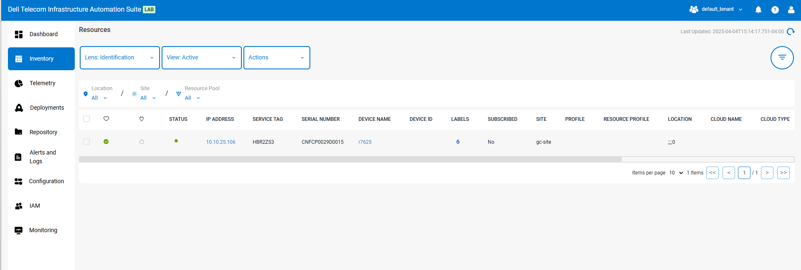
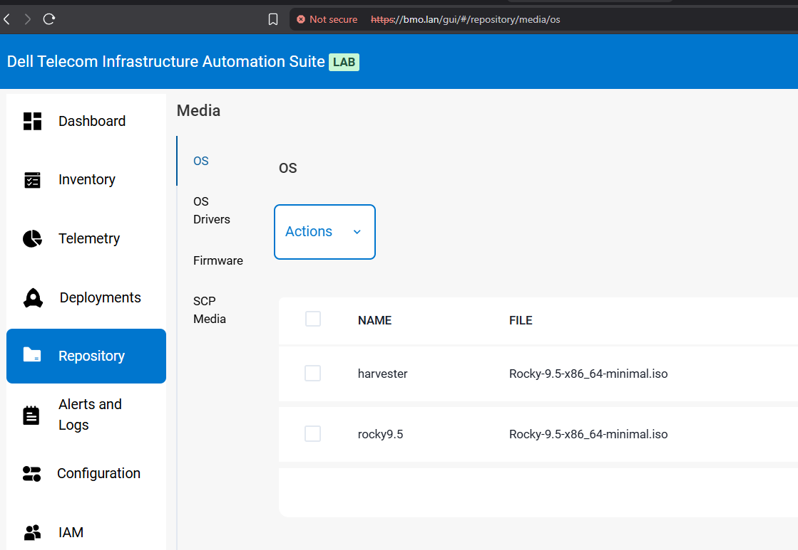
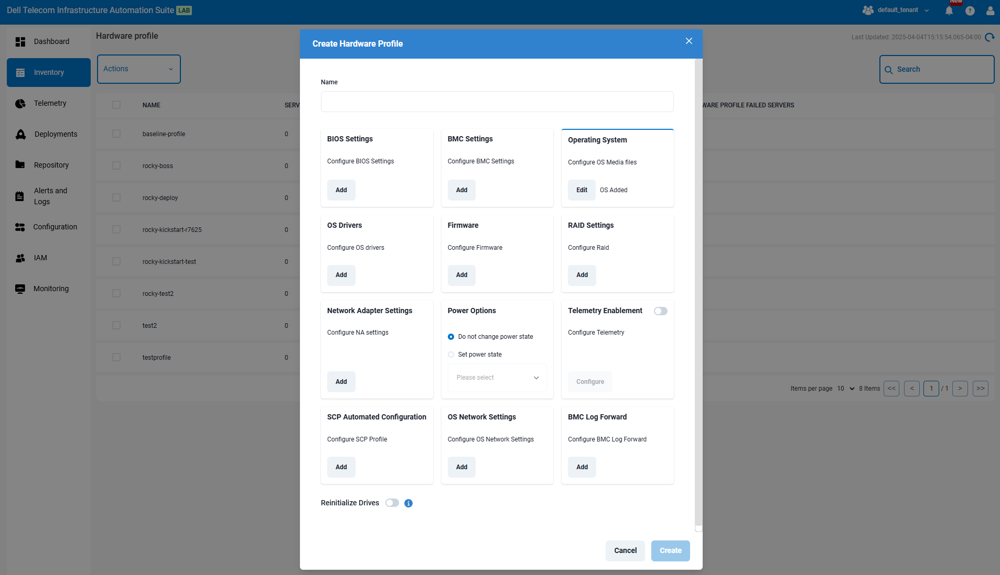

# Manually Creating a PXE Framework vs DTIAS

- [Manually Creating a PXE Framework vs DTIAS](#manually-creating-a-pxe-framework-vs-dtias)
  - [Synopsis](#synopsis)
  - [Issues with a Manual Buildout](#issues-with-a-manual-buildout)
    - [0. Users Need GUIs](#0-users-need-guis)
    - [1. Manual Tracking of MAC-to-Hostname/IP Mappings](#1-manual-tracking-of-mac-to-hostnameip-mappings)
    - [2. Manually Creating `config-*.yaml` Files](#2-manually-creating-config-yaml-files)
    - [3. Manually Writing iPXE Scripts per Node](#3-manually-writing-ipxe-scripts-per-node)
    - [4. Hand-Editing DHCP Config](#4-hand-editing-dhcp-config)
    - [5. High Risk of Human Error](#5-high-risk-of-human-error)
    - [6. Debugging is DIY](#6-debugging-is-diy)
    - [7. No Built-in Auth, RBAC, or History](#7-no-built-in-auth-rbac-or-history)
    - [8. No Unified View of Node Status](#8-no-unified-view-of-node-status)
    - [9. You Must Manage All Infra Yourself](#9-you-must-manage-all-infra-yourself)
    - [10. No API for Integrating with Other Systems](#10-no-api-for-integrating-with-other-systems)
    - [11. Deal with UEFI PXE Boot Oddities](#11-deal-with-uefi-pxe-boot-oddities)
  - [How This Will Work with DTIAS](#how-this-will-work-with-dtias)

## Synopsis

I was asked recently why someone would want to use DTIAS over manually creating a PXE-boot infrastructure. To that end, I first went and [built it out myself](./README.md) to make sure it was in fact what I was expecting. That tutorial gets into the weeds of everything you will have to do to build out Harvester. To abbreviate, here's everything you have to do:

- Set static IP, subnet, and gateway on the PXE/HTTP/DHCP host
- Ensure you are running a compatible Linux distribution (e.g., Rocky 9.5)
- Decide on network configuration (IP range, VIP, MAC mappings)
- Create a directory for Harvester boot files
- Download Harvester ISO, vmlinuz, initrd, and rootfs
- Download ipxe.efi binary
- Place all artifacts in the HTTP server directory
- Install and configure nginx as an HTTP server
- Set SELinux context on the HTTP root directory
- Open HTTP port in the firewall
- Generate an SSH keypair to use with Harvester nodes
- Record each node’s MAC address, hostname, and static IP assignment
- Install and configure ISC DHCP server
- Write DHCP configuration:
  - Define subnet, range, gateway, DNS
  - Add static `host` entries for each node with IP and MAC
  - Write conditional logic for UEFI/BIOS and iPXE detection
- Optionally install and configure a TFTP server for legacy PXE clients
- Create iPXE boot scripts for each node:
  - For create node (`ipxe-create`, `ipxe-create-efi`)
  - For each join node (`ipxe-join-harvX`, `ipxe-join-harvX-efi`)
- Create Harvester YAML config files:
  - `config-create.yaml` for the first node
  - `config-join-harvX.yaml` for each join node
- Reference the correct MAC, hostname, VIP, and disk device in each YAML
- Restart DHCP server and confirm it is running
- Power on the VMs and monitor network boot
- Verify each node boots and installs Harvester successfully
- Access the Harvester web UI at the VIP address
- Troubleshoot PXE failures as needed (DHCP logs, nginx access logs, etc.)
- Version mismatches. Different parts of your system are updated at different times and become incompatible. Ex: you update DHCP to use newer syntax but the version of UEFI the system's have don't support it.

That's assuming that you're only doing this on a few nodes. For anything at scale you will have to build out a custom automation framework as I [explain below](#1-manual-tracking-of-mac-to-hostnameip-mappings) to really accomplish this. Some of these things are unavoidable. Ex: network planning is something that has to happen either way, but most of those things are automation tasks already built into DTIAS.

In the below section [Issues with a Manual Buildout](#issues-with-a-manual-buildout) I get into some of the major considerations you will have with a manual buildout. I only go through the immediately obvious, but there are a lot of other things to think about. Ex: code repositories, code revision management, collaboration tools you will inevitably need for development, etc.

In the last section [How This Will work with DTIAS](#how-this-will-work-with-dtias) I explain how this works with DTIAS.

## Issues with a Manual Buildout

### 0. Users Need GUIs
- Manual Buildout
  - There is no GUI unless you hire / find frontend devs to do it
  - This also means there is no input validation outside of what you build
- DTIAS Proposed Harvester Feature
  - Already has built in input validation in the GUI [as shown below](#how-this-will-work-with-dtias) and we would add input validation for DTIAS

This is potentially the most significant drawback. Unless all users of the system will be system administrators with a high degree of comfort on the Linux command line, a GUI is effectively required. At least in my personal experience, my success rate getting most computer people to use CLI tools is low. It's possible, but usually highly problematic and comes with a lot of phone calls back to me which I was never fond of.

---

### 1. Manual Tracking of MAC-to-Hostname/IP Mappings
- Manual Buildout
  - Maintain a spreadsheet or YAML list of every node’s MAC, IP, hostname, and role
  - Hand-copy each one into DHCP config and YAML files 
  - Alternatively, you will have to build out some sort of automation infrastructure. Speaking from experience, the way you usually do this is to have some source of truth, pull that via Jinja2 into an Ansible inventory, and then you have a series of Ansible roles which lays out all the correct DHCP configs.
    - I have done this personally many times and it is time consuming and problematic to maintain. I demo a simplified version of this in my article [Build Preboot Environment with Ansible](../Build%20Preboot%20Environment%20with%20Ansible/README.md)
- DTIAS Proposed Harvester Feature:
  - Because it has access to the iDRAC, it can do things like automatically pull the physically UP interfaces and use those rather than making you manually configure them so you don't have to track MAC addresses
  - It has an API so you can use REST to fill out the IP address for the operating system build out

---

### 2. Manually Creating `config-*.yaml` Files
- Manual Buildout
  - Must write or generate separate YAMLs per host (e.g., `config-join-harv2.yaml`)
    - As I mentioned before, you can do this with automation & Jinja2 templates, but it becomes cumbersome to maintain and even less pleasant to troubleshoot
  - Inject SSH keys and tokens manually
  - Duplicate and vary settings by hand (hostname, MAC, IP, etc.)
- DTIAS Proposed Harvester Feature:
  - Dynamically builds YAMLs in the background with correct injection
  - Offers a form to select settings; YAML never exposed unless needed

---

### 3. Manually Writing iPXE Scripts per Node
- Manual Buildout
  - Copy and tweak iPXE templates for each host
  - Must keep `ipxe-join-harvX` scripts aligned with `config-join-harvX.yaml` manually
- DTIAS Proposed Harvester Feature:
  - Generates and serves the correct script automatically
  - Possibly uses dynamic boot endpoints (`/ipxe/<mac>`)

---

### 4. Hand-Editing DHCP Config
- Manual Buildout
  - Edit `/etc/dhcp/dhcpd.conf` to add each host and filename rules
  - Must handle group logic, IP conflicts, and ensure unique hostnames
- DTIAS Proposed Harvester Feature:
  - Manages this programmatically
  - Validates the config before applying

---

### 5. High Risk of Human Error
- Manual Buildout
  - Might mistype a MAC, IP, or filename
  - Can cause multiple nodes to boot the wrong config
  - Could break DHCP or PXE behavior for everyone if config is wrong
- DTIAS Proposed Harvester Feature:
  - Sanitizes input, prevents duplicates, and warns of inconsistencies

---

### 6. Debugging is DIY
- Manual Buildout
  - Write your own troubleshooting scripts
  - Manually inspect logs (DHCP, nginx, etc.)
- DTIAS Proposed Harvester Feature:
  - Provides dashboards or logs for each node’s provisioning status
  - Can even retry installs or clean up failed attempts

---

### 7. No Built-in Auth, RBAC, or History
- Manual Buildout
  - Anyone can modify YAMLs or PXE logic if they have shell access
  - No tracking of who built what
- DTIAS Proposed Harvester Feature:
  - Provides audit trails, authentication, and user isolation

---

### 8. No Unified View of Node Status
- Manual Buildout
  - Have to manually check each console
  - No central view to say which nodes booted, joined, or failed
- DTIAS Proposed Harvester Feature:
  - Live status of each node’s install phase and cluster join status along with full telemetry

---

### 9. You Must Manage All Infra Yourself
- Manual Buildout
  - Maintain and patch the TFTP, HTTP, DHCP servers
  - Deal with SELinux and firewall issues
- DTIAS Proposed Harvester Feature:
  - Bundles these in a containerized setup or appliance

---

### 10. No API for Integrating with Other Systems
- Manual Buildout
  - If you want to connect your provisioning to a CMDB, asset tracker, or automation, you must build all integration points manually
- DTIAS Proposed Harvester Feature:
  - Exposes a REST API or CLI for orchestration and scripting

### 11. Deal with UEFI PXE Boot Oddities
- Manual Buildout
  - For example, when I was working through my tutorial I discovered on older versions of UEFI [they must have the `next-server` option](https://serverfault.com/questions/1178186/vmware-esxi-vm-will-not-connect-over-tftp-when-using-uefi-firmware-when-pxe-boot/1178232#1178232). I ended up creating a serverfault question and answering it myself, but suffice it to say you're on the hook for figuring out quirks like this
- DTIAS Proposed Harvester Features
  - It takes care of all of this for you

## How This Will Work with DTIAS

- You will import all of your servers into DTIAS by service tag

- Add the Harvester ISO and accompanying binaries to the software store in DTIAS

 

- Create a hardware profile which includes Harvester. Pictured below are the options for Rocky. We will update them for Harvester.

- Select all the servers to which you want to deploy Harvester
- Click deploy - Harvester then deploys on all servers
