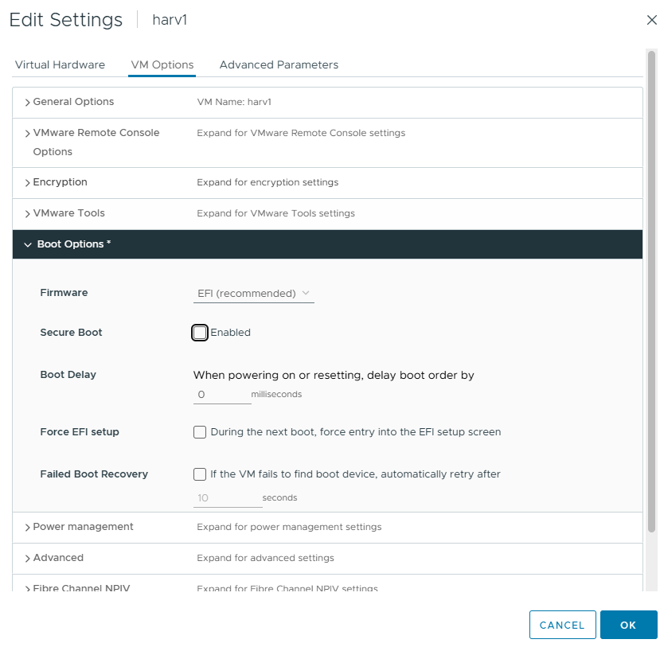

# Build Harvester over the Network

- [Build Harvester over the Network](#build-harvester-over-the-network)
  - [Network Setup Assumptions](#network-setup-assumptions)
  - [PXE Host OS](#pxe-host-os)
  - [Secure Boot](#secure-boot)
  - [Generate SSH Key (Required for Harvester Access)](#generate-ssh-key-required-for-harvester-access)
  - [Configure HTTP Server](#configure-http-server)
  - [Download and Place Boot Artifacts](#download-and-place-boot-artifacts)
  - [\[Optional\] Install TFTP Server (Fallback for Legacy PXE Clients)](#optional-install-tftp-server-fallback-for-legacy-pxe-clients)
    - [Install tftp-server](#install-tftp-server)
    - [🔧 Configure TFTP Service](#-configure-tftp-service)
    - [Enable and Start the TFTP Service](#enable-and-start-the-tftp-service)
    - [Open Firewall Port](#open-firewall-port)
    - [Test TFTP](#test-tftp)
  - [DHCP Server Configuration (ISC DHCP)](#dhcp-server-configuration-isc-dhcp)
    - [Logic Overview](#logic-overview)
    - [Install ISC DHCP Server on Rocky 9](#install-isc-dhcp-server-on-rocky-9)
    - [Configure `/etc/dhcp/dhcpd.conf`](#configure-etcdhcpdhcpdconf)
    - [Step 3: Restart DHCP](#step-3-restart-dhcp)
  - [Create Required Scripts](#create-required-scripts)
  - [Create Configurations](#create-configurations)
    - [Create `config-create.yaml` (for first node)](#create-config-createyaml-for-first-node)
    - [Create `config-join.yaml` (for all JOIN nodes)](#create-config-joinyaml-for-all-join-nodes)
  - [Troubleshooting PXE](#troubleshooting-pxe)
    - [Basic Problems](#basic-problems)
    - [Getting Stuck Right After Pulling an IP](#getting-stuck-right-after-pulling-an-ip)

## Network Setup Assumptions

| Component         | Value                               |
|------------------|-------------------------------------|
| HTTP Server IP   | `10.10.25.200`                        |
| Subnet           | `10.10.25.0/24`                      |
| Router/Gateway   | `10.10.25.200` (same as HTTP server)  |
| DNS              | `8.8.8.8`                            |
| VIP for cluster  | `10.10.25.209`                        |
| NIC              | `ens5`                               |
| ISO Version      | `v1.4.2`                             |
| Boot Directory   | `/usr/share/nginx/html/harvester/`  |

## PXE Host OS

```bash
[grant@rockydesktop ~]$ cat /etc/*-release
NAME="Rocky Linux"
VERSION="9.5 (Blue Onyx)"
ID="rocky"
ID_LIKE="rhel centos fedora"
VERSION_ID="9.5"
PLATFORM_ID="platform:el9"
PRETTY_NAME="Rocky Linux 9.5 (Blue Onyx)"
ANSI_COLOR="0;32"
LOGO="fedora-logo-icon"
CPE_NAME="cpe:/o:rocky:rocky:9::baseos"
HOME_URL="https://rockylinux.org/"
VENDOR_NAME="RESF"
VENDOR_URL="https://resf.org/"
BUG_REPORT_URL="https://bugs.rockylinux.org/"
SUPPORT_END="2032-05-31"
ROCKY_SUPPORT_PRODUCT="Rocky-Linux-9"
ROCKY_SUPPORT_PRODUCT_VERSION="9.5"
REDHAT_SUPPORT_PRODUCT="Rocky Linux"
REDHAT_SUPPORT_PRODUCT_VERSION="9.5"
Rocky Linux release 9.5 (Blue Onyx)
Rocky Linux release 9.5 (Blue Onyx)
Rocky Linux release 9.5 (Blue Onyx)
```

## Secure Boot

In my setup I was using VMs ipxe.efi isn't signed so for my experiment I didn't run secure boot:



## Generate SSH Key (Required for Harvester Access)

Harvester nodes use the `rancher` user by default and expect a public SSH key for login if you want passwordless, secure access.

If you don’t already have an SSH key, generate one:

```bash
ssh-keygen -t rsa -b 4096 -C "your_email@example.com"
```

When prompted, press **Enter** to accept the default file path (`~/.ssh/id_rsa`).

Then, copy the **public key** to use in your Harvester configs:

```bash
cat ~/.ssh/id_rsa.pub
```

## Configure HTTP Server

```bash
sudo dnf install -y nginx
sudo systemctl enable --now nginx
sudo chcon -Rt httpd_sys_content_t /usr/share/nginx/html/harvester
sudo firewall-cmd --add-service=http --permanent
sudo firewall-cmd --reload
```

## Download and Place Boot Artifacts

Download the following files from the [Harvester Releases page](https://github.com/harvester/harvester/releases):

From the release you're using, download:

- The **ISO file**
- The **vmlinuz** kernel
- The **initrd** image
- The **rootfs squashfs** file

Also download the UEFI iPXE binary:

- `ipxe.efi` from [http://boot.ipxe.org/ipxe.efi](http://boot.ipxe.org/ipxe.efi)
  - `wget http://boot.ipxe.org/ipxe.efi`

Place them all into your HTTP server directory:

```bash
mkdir -p /usr/share/nginx/html/harvester
# Copy all downloaded files into this directory
```

## [Optional] Install TFTP Server (Fallback for Legacy PXE Clients)

Some systems may not support HTTP boot correctly. For those cases, TFTP can be used to deliver `ipxe.efi` or `undionly.kpxe`.

This section sets up a basic TFTP server that shares the same boot files you're already serving over HTTP.

### Install tftp-server

```bash
# Install tftp-server package
sudo dnf install -y tftp-server tftp

# Create the TFTP root directory
sudo mkdir -p /var/lib/tftpboot/harvester

# Copy HTTP server files to the TFTP root (symlinks won't work due to chroot)
sudo cp /usr/share/nginx/html/harvester/ipxe.efi /var/lib/tftpboot/ipxe.efi
sudo cp /usr/share/nginx/html/harvester/ipxe-create /var/lib/tftpboot/harvester/ipxe-create
sudo cp /usr/share/nginx/html/harvester/ipxe-join /var/lib/tftpboot/harvester/ipxe-join

# Set SELinux context for TFTP access
sudo chcon -Rt tftpdir_t /var/lib/tftpboot

# Start TFTP server
sudo systemctl enable --now tftp.socket
```

### 🔧 Configure TFTP Service

Create a new systemd socket + service override config:

```bash
sudo tee /etc/systemd/system/tftp.socket > /dev/null <<EOF
[Unit]
Description=TFTP socket
Documentation=man:in.tftpd
Before=inetd.service

[Socket]
ListenDatagram=69
SocketMode=0666

[Install]
WantedBy=sockets.target
EOF

sudo tee /etc/systemd/system/tftp.service > /dev/null <<EOF
[Unit]
Description=TFTP server
Requires=tftp.socket
Documentation=man:in.tftpd

[Service]
ExecStart=/usr/sbin/in.tftpd -s /var/lib/tftpboot
StandardInput=socket
EOF
```

### Enable and Start the TFTP Service

```bash
sudo systemctl daemon-reexec
sudo systemctl daemon-reload
sudo systemctl enable --now tftp.socket
```

### Open Firewall Port

```bash
sudo firewall-cmd --add-service=tftp --permanent
sudo firewall-cmd --reload
```

### Test TFTP

```bash
tftp 10.10.25.200
tftp> get ipxe.efi
tftp> quit
```

If it downloads successfully, your TFTP fallback is live.

## DHCP Server Configuration (ISC DHCP)

I am using the following:

| Detail                     | Value               |
|----------------------------|---------------------|
| DHCP/HTTP Server IP       | `10.10.25.200`        |
| Subnet                    | `10.10.25.0/24`      |
| DHCP Range                | `10.10.25.200–96`     |
| VIP for Harvester cluster | `10.10.25.209`        |
| Interface Name            | `ens5`               |

| VM     | MAC Address           | IP Address     | Mode   | Hostname   |
|--------|------------------------|----------------|--------|------------|
| harv1  | `00:50:56:8a:ce:66`    | `10.10.25.201`  | CREATE | `harv1`    |
| harv2  | `00:50:56:8a:99:71`    | `10.10.25.202`  | JOIN   | `harv2`    |
| harv3  | `00:50:56:8a:53:e9`    | `10.10.25.203`  | JOIN   | `harv3`    |

### Logic Overview

1. **UEFI HTTP client boots → sends DHCP request**
   - DHCP sees `vendor-class-identifier = "HTTPClient"`
2. **DHCP replies with**:
   ```dhcp
   filename "http://10.10.25.200/harvester/ipxe.efi";
   ```
   → This gives the UEFI client the raw iPXE binary

3. The client **loads and executes `ipxe.efi`**
4. Then the iPXE binary sends **a second DHCP request**
   - This time it sends `user-class = "iPXE"`
5. DHCP replies with either:
   - `ipxe-create-efi` (for CREATE node)
   - `ipxe-join-efi` (for JOIN nodes)

### Install ISC DHCP Server on Rocky 9

```bash
sudo dnf install -y dhcp-server
sudo systemctl enable --now dhcpd
```

### Configure `/etc/dhcp/dhcpd.conf`

Paste this **entire config**:

```shell
# Defines the client architecture type (used to detect UEFI vs BIOS)
option architecture-type code 93 = unsigned integer 16;

# Define your subnet, gateway, DNS, and a fallback range
subnet 10.10.25.0 netmask 255.255.255.0 {
  option routers 10.10.25.200;               # <--- ✅ Set this to your PXE/DHCP/HTTP server's IP
  option domain-name-servers 8.8.8.8;        # <--- ✅ Optional: your preferred DNS servers
  range 10.10.25.200 10.10.25.206;           # <--- ✅ Fallback DHCP range (not used with static leases below)
  deny unknown-clients;                      # <--- ✅ Ensures only MACs listed below get leases
}

# --- CREATE NODE (first node bootstraps the cluster) ---
group {
  # Boot logic: switch between iPXE and PXE modes
  if exists user-class and option user-class = "iPXE" {
    if option architecture-type = 00:07 {
      filename "http://10.10.25.200/harvester/ipxe-create-efi";  # <--- ✅ Update with your HTTP server IP
    } else {
      filename "http://10.10.25.200/harvester/ipxe-create";      # <--- ✅ Update if using non-UEFI iPXE
    }
  } else {
    # Fallback to legacy PXE boot (TFTP)
    if option architecture-type = 00:07 {
      filename "ipxe.efi";          # <--- ✅ Served via TFTP for UEFI
    } else {
      filename "undionly.kpxe";     # <--- ✅ Served via TFTP for BIOS
    }
  }

  host harv1 {
    hardware ethernet 00:50:56:8a:ce:66;     # <--- ✅ MAC address of your CREATE node (harv1)
    fixed-address 10.10.25.201;             # <--- ✅ Static IP for harv1
  }
}

# --- JOIN NODE: harv2 ---
group {
  if exists user-class and option user-class = "iPXE" {
    if option architecture-type = 00:07 {
      filename "http://10.10.25.200/harvester/ipxe-join-efi";    # <--- ✅ Update with your HTTP server IP
    } else {
      filename "http://10.10.25.200/harvester/ipxe-join";
    }
  } else {
    if option architecture-type = 00:07 {
      filename "ipxe.efi";
    } else {
      filename "undionly.kpxe";
    }
  }

  host harv2 {
    hardware ethernet 00:50:56:8a:99:71;     # <--- ✅ MAC address of harv2
    fixed-address 10.10.25.202;             # <--- ✅ Static IP for harv2
  }
}

# --- JOIN NODE: harv3 ---
group {
  if exists user-class and option user-class = "iPXE" {
    if option architecture-type = 00:07 {
      filename "http://10.10.25.200/harvester/ipxe-join-efi";    # <--- ✅ Update with your HTTP server IP
    } else {
      filename "http://10.10.25.200/harvester/ipxe-join";
    }
  } else {
    if option architecture-type = 00:07 {
      filename "ipxe.efi";
    } else {
      filename "undionly.kpxe";
    }
  }

  host harv3 {
    hardware ethernet 00:50:56:8a:53:e9;     # <--- ✅ MAC address of harv3
    fixed-address 10.10.25.203;             # <--- ✅ Static IP for harv3
  }
}
```

### Step 3: Restart DHCP

```bash
sudo systemctl restart dhcpd
```

Check logs for any issues:

```bash
journalctl -u dhcpd -xe
```

## Create Required Scripts

```bash
HARVESTER_VERSION="v1.4.2"  # <--- Update with your harvester version
HTTP_SERVER="10.10.25.200"

mkdir -p /usr/share/nginx/html/harvester

cat <<EOF > /usr/share/nginx/html/harvester/ipxe-create
#!ipxe
kernel http://$HTTP_SERVER/harvester/harvester-$HARVESTER_VERSION-vmlinuz-amd64 initrd=harvester-$HARVESTER_VERSION-initrd-amd64 ip=dhcp net.ifnames=1 rd.cos.disable rd.noverifyssl console=tty1 root=live:http://$HTTP_SERVER/harvester/harvester-$HARVESTER_VERSION-rootfs-amd64.squashfs harvester.install.automatic=true harvester.install.config_url=http://$HTTP_SERVER/harvester/config-create.yaml
initrd http://$HTTP_SERVER/harvester/harvester-$HARVESTER_VERSION-initrd-amd64
boot
EOF

cp /usr/share/nginx/html/harvester/ipxe-create /usr/share/nginx/html/harvester/ipxe-create-efi

cat <<EOF > /usr/share/nginx/html/harvester/ipxe-join
#!ipxe
kernel http://$HTTP_SERVER/harvester/harvester-$HARVESTER_VERSION-vmlinuz-amd64 initrd=harvester-$HARVESTER_VERSION-initrd-amd64 ip=dhcp net.ifnames=1 rd.cos.disable rd.noverifyssl console=tty1 root=live:http://$HTTP_SERVER/harvester/harvester-$HARVESTER_VERSION-rootfs-amd64.squashfs harvester.install.automatic=true harvester.install.config_url=http://$HTTP_SERVER/harvester/config-join.yaml
initrd http://$HTTP_SERVER/harvester/harvester-$HARVESTER_VERSION-initrd-amd64
boot
EOF

cp /usr/share/nginx/html/harvester/ipxe-join /usr/share/nginx/html/harvester/ipxe-join-efi
```

## Create Configurations

Now that your PXE and HTTP services are ready, it's time to define the configuration files that tell each Harvester node how to install and what role it should play in the cluster.

These YAML files are consumed automatically by Harvester during PXE boot and allow fully unattended installs.

You'll need two files:

- `config-create.yaml`: for the first node (it creates the cluster)
- `config-join.yaml`: for all additional nodes (they join the cluster)

These files are served from your HTTP server and referenced in your iPXE boot scripts.

**What to Expect**

- Each node will download the YAML config during boot.
- The first node will initialize the Harvester cluster.
- Remaining nodes will automatically join once they boot with their config.
- You'll be able to access the Harvester UI at the **VIP address** you specify (e.g., `https://10.10.25.209`).

Make sure to update all placeholder values (SSH key, IPs, version, etc.) where marked. As before the text blocks are setup to be copied and pasted.

Then, power on your VMs and watch your cluster build itself.

### Create `config-create.yaml` (for first node)

```yml
SSH_KEY=$(cat ~/.ssh/id_rsa.pub 2>/dev/null)
if [ -z "$SSH_KEY" ]; then
  echo "❌ SSH key not found at ~/.ssh/id_rsa.pub"
  echo "👉 Generate one with: ssh-keygen -t rsa"
  exit 1
fi

cat <<EOF > /usr/share/nginx/html/harvester/config-create.yaml
scheme_version: 1
token: harvester-cluster-token

os:
  hostname: harv1
  password: PASSWORD
  ssh_authorized_keys:
    - $SSH_KEY
  ntp_servers:
    - 0.suse.pool.ntp.org
    - 1.suse.pool.ntp.org

install:
  mode: create
  management_interface:
    method: dhcp
    default_route: true
  device: /dev/sda
  iso_url: http://10.10.25.200/harvester/harvester-v1.4.2-amd64.iso
  vip: 10.10.25.209
  vip_mode: static
EOF
```

### Create `config-join.yaml` (for all JOIN nodes)

```yml
SSH_KEY=$(cat ~/.ssh/id_rsa.pub 2>/dev/null)
if [ -z "$SSH_KEY" ]; then
  echo "❌ SSH key not found at ~/.ssh/id_rsa.pub"
  echo "👉 Generate one with: ssh-keygen -t rsa"
  exit 1
fi

cat <<EOF > /usr/share/nginx/html/harvester/config-join.yaml
scheme_version: 1
token: harvester-cluster-token
server_url: https://10.10.25.209:443
os:
  hostname: harv2
  password: PASSWORD
  ssh_authorized_keys:
    - $SSH_KEY
  dns_nameservers:
    - 8.8.8.8
install:
  mode: join
  management_interface:
    default_route: true
    method: dhcp
  device: /dev/sda
  iso_url: http://10.10.25.200/harvester/harvester-v1.4.2-amd64.iso
  skip_bonding: true
EOF
```

## Troubleshooting PXE

### Basic Problems

It's pretty common to have problems trying to get PXE to work so I created this BASH troubleshooting script to check for issues:

```bash
#!/bin/bash

NODE_NAME="harv1"
NODE_MAC="00:50:56:8a:ce:66"
NODE_IP="10.10.25.201"
HTTP_SERVER="10.10.25.200"
PXE_DIR="/usr/share/nginx/html/harvester"
REPORT=$(mktemp)

echo "========== Harvester PXE Troubleshooter =========="
echo "📌 Node: $NODE_NAME | MAC: $NODE_MAC | IP: $NODE_IP"
echo "📌 HTTP Server: $HTTP_SERVER"
echo

# Check DHCP host entry
echo "==> Checking DHCP host entry for $NODE_NAME"
grep -A5 "host $NODE_NAME" /etc/dhcp/dhcpd.conf > /tmp/dhcp_host_entry.txt
if ! grep -q "$NODE_MAC" /tmp/dhcp_host_entry.txt; then
  echo "❌ Missing or wrong MAC in DHCP config for $NODE_NAME" >> "$REPORT"
fi
if ! grep -q "$NODE_IP" /tmp/dhcp_host_entry.txt; then
  echo "❌ Missing or wrong IP in DHCP config for $NODE_NAME" >> "$REPORT"
fi

# Check DHCP filename logic
echo "==> Checking DHCP boot script logic"
if ! grep -q "filename.*ipxe-create-efi" /etc/dhcp/dhcpd.conf; then
  echo "❌ DHCP config missing filename for ipxe-create-efi" >> "$REPORT"
fi
if ! grep -q "HTTPClient" /etc/dhcp/dhcpd.conf; then
  echo "❌ DHCP config missing HTTPClient detection logic" >> "$REPORT"
fi
if ! grep -q "user-class.*iPXE" /etc/dhcp/dhcpd.conf; then
  echo "❌ DHCP config missing iPXE user-class detection logic" >> "$REPORT"
fi

# Check DHCP logs
echo "==> Checking recent DHCP logs"
journalctl -u dhcpd -n 20 | grep "$NODE_MAC" > /tmp/dhcp_mac_log.txt
if [ ! -s /tmp/dhcp_mac_log.txt ]; then
  echo "❌ No DHCP logs for MAC $NODE_MAC (maybe not booting correctly?)" >> "$REPORT"
fi

# Check iPXE files
echo "==> Checking iPXE script files"
for file in ipxe-create ipxe-create-efi ipxe.efi; do
  if [ ! -f "$PXE_DIR/$file" ]; then
    echo "❌ Missing $file in $PXE_DIR" >> "$REPORT"
  fi
done

# Check HTTP access
echo "==> Checking HTTP access to ipxe-create-efi"
if ! curl -s -I "http://$HTTP_SERVER/harvester/ipxe-create-efi" | grep -q "200 OK"; then
  echo "❌ HTTP file not accessible: ipxe-create-efi" >> "$REPORT"
fi

# SELinux context
echo "==> Checking SELinux context on $PXE_DIR"
if ! ls -Zd "$PXE_DIR" | grep -q "httpd_sys_content_t"; then
  echo "❌ Wrong SELinux context on $PXE_DIR — fix with: sudo chcon -Rt httpd_sys_content_t $PXE_DIR" >> "$REPORT"
fi

# Show only problems
echo
echo "============= ❗ Detected Problems ❗ ============="
if [ -s "$REPORT" ]; then
  cat "$REPORT"
else
  echo "✅ No obvious issues found. Boot problem may be firmware-related."
fi
echo "=================================================="

rm "$REPORT"
```

### Getting Stuck Right After Pulling an IP

If your VM is getting stuck right after pulling an IP, my advice is to check to see if the VM is even requesting ipxe.efi with: `sudo tail -f /var/log/nginx/access.log`