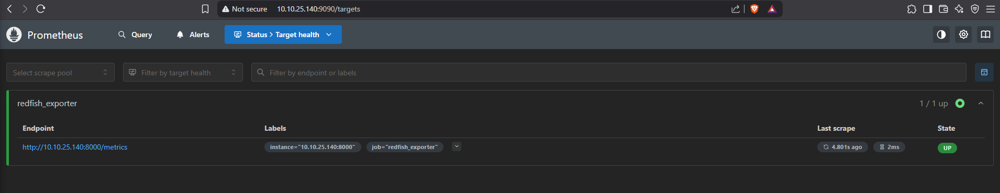
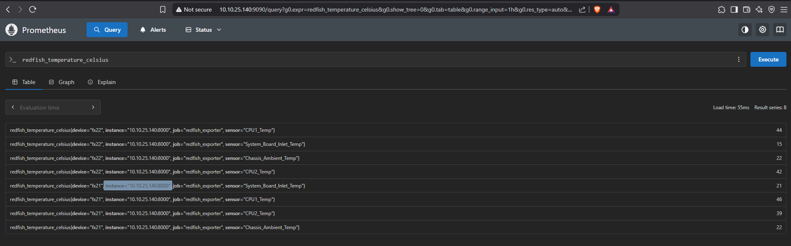
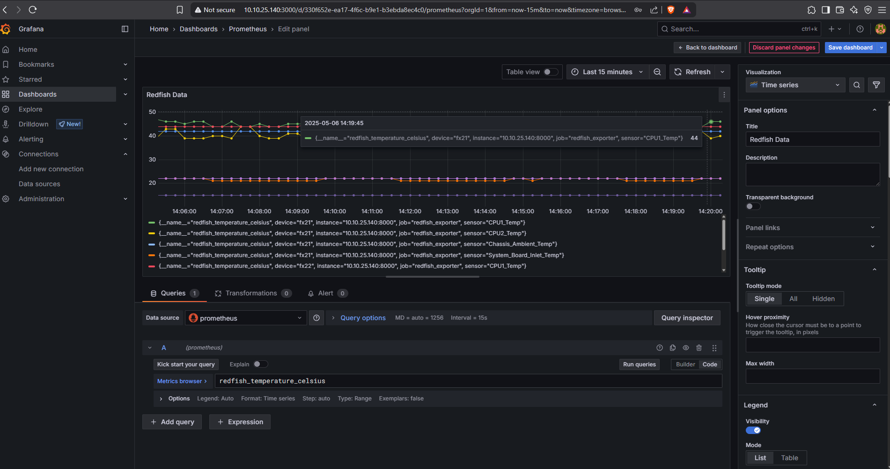

# Creating a Redfish Monitoring Infrastructure

- [Creating a Redfish Monitoring Infrastructure](#creating-a-redfish-monitoring-infrastructure)
  - [Introduction](#introduction)
  - [Architecture](#architecture)
    - [Grafana (Dashboards)](#grafana-dashboards)
    - [Prometheus (Time Series Database)](#prometheus-time-series-database)
    - [Redfish Exporter (Exposes /metrics)](#redfish-exporter-exposes-metrics)
    - [Redfish Poller (not shown in diagram, runs beneath Exporter)](#redfish-poller-not-shown-in-diagram-runs-beneath-exporter)
    - [Redfish-Enabled Server / PDU](#redfish-enabled-server--pdu)
    - [Redfish-Enabled IRC / CDU Device](#redfish-enabled-irc--cdu-device)
  - [Prerequisites](#prerequisites)
  - [Step-by-Step Setup on Rocky Linux 9](#step-by-step-setup-on-rocky-linux-9)
    - [1. Install Required Packages](#1-install-required-packages)
    - [2. Clone the Project](#2-clone-the-project)
    - [3. Edit `devices.yaml`](#3-edit-devicesyaml)
    - [4. Install Python Requirements](#4-install-python-requirements)
    - [5. Run the Exporter and Poller](#5-run-the-exporter-and-poller)
    - [6. Configure Prometheus](#6-configure-prometheus)
    - [7. Run Prometheus via Podman](#7-run-prometheus-via-podman)
    - [8. Run Grafana via Podman](#8-run-grafana-via-podman)
    - [9. Configure Grafana and Create Dashboards](#9-configure-grafana-and-create-dashboards)
  - [✅ Done!](#-done)
  - [Controlling Redfish-Enabled Devices](#controlling-redfish-enabled-devices)
    - [Dell Resources](#dell-resources)
    - [APC PDUs](#apc-pdus)

---

## Introduction

This document explains how to set up a simple Redfish Monitoring Infrastructure from scratch on Rocky Linux 9. The purpose of this repository is to demonstrate a simple workflow. In production, there are a number of things you will want to do to make this more robust. For example, I only show how to do this with temperature with [a simple data exporter](./exporter/app.py). Depending on your use case, you may want to create your own exporter, but others exist, for example [sapcc/redfish-exporter](https://github.com/sapcc/redfish-exporter).

---

## Architecture

```text
               +------------------------+
               |       Grafana          |
               |   (Dashboards)         |
               +-----------+------------+
                           |
                           ▼
                   +---------------+
                   |  Prometheus   |
                   | (Time Series) |
                   +-------+-------+
                           ▲
                           |
                  +--------+-------------+
                  |  Redfish Exporter    |
                  |   (Exposes /metrics) |
                  +--------+-------------+
                           ▲
                           |
           +---------------+---------------+
           |                               |
+--------------------+     +--------------------+
|  Redfish-Enabled    |     |  Redfish-Enabled    |
|   Server / PDU      |     |  IRC / CDU Device   |
+--------------------+     +--------------------+
```

### Grafana (Dashboards)

Grafana is a visualization platform that provides real-time dashboards and historical views of time-series data. In this infrastructure, it connects to Prometheus as a data source to display charts, gauges, and alerts based on the metrics collected from Redfish-enabled devices. Users can interact with dashboards to monitor device temperatures, fan speeds, power draw, and other health indicators. Grafana also supports custom alerting rules and can send notifications when thresholds are exceeded.

---

### Prometheus (Time Series Database)

Prometheus is a pull-based monitoring system and time-series database. It scrapes the [Redfish Exporter's](./exporter/app.py) `/metrics` endpoint at regular intervals and stores the data along with timestamps. It provides a query language (PromQL) to filter, aggregate, and analyze metrics. Prometheus is responsible for managing retention policies, generating alerts based on rules, and serving data to Grafana or other clients.

---

### Redfish Exporter (Exposes /metrics)

[The Redfish Exporter](./exporter/app.py) is a lightweight Flask or FastAPI application that exposes a `/metrics` endpoint in Prometheus text format. It reads metrics written to a local `metrics.prom` file by the [Redfish Poller](./poller/poller.py). The exporter acts as a bridge between the file-based output of the poller and Prometheus' HTTP-based scraping model. It does not collect data itself but serves the latest available data for Prometheus to consume.

---

### Redfish Poller (not shown in diagram, runs beneath Exporter)

The Redfish Poller is a custom Python script that authenticates to each Redfish-enabled device, queries specific Redfish API endpoints (e.g., Thermal, Power), and extracts structured metrics. It formats this data into Prometheus-compatible text and writes it to a `metrics.prom` file. The poller runs continuously in a loop, updating the file at fixed intervals (e.g., every 15 seconds).

---

### Redfish-Enabled Server / PDU

These are physical or virtual devices such as servers and power distribution units that expose Redfish APIs for telemetry and control. Common metrics retrieved from servers include CPU temperature, inlet/outlet temperature, fan speeds, and power consumption. Redfish is typically implemented on out-of-band management controllers like iDRAC (Dell), iLO (HPE), or BMCs (Baseboard Management Controllers).

---

### Redfish-Enabled IRC / CDU Device

IRC (Intelligent Rack Controller) and CDU (Cooling Distribution Unit) devices also support Redfish and provide metrics for rack-level or cooling infrastructure. The poller queries them just like servers, accessing Redfish endpoints to retrieve environmental metrics such as ambient temperature, rack airflow, or coolant levels, depending on device capabilities.

## Prerequisites

* Rocky Linux 9
* Network access to Redfish-enabled devices (e.g., Dell iDRAC, PDU, IRC, or CDU)
* Python 3.9+ and `pip`
* Podman (used in place of Docker)

## Step-by-Step Setup on Rocky Linux 9

### 1. Install Required Packages

```bash
sudo dnf install -y python3 python3-pip podman podman-docker git
```

Optional: create `/etc/containers/nodocker` to suppress Docker compatibility warnings:

```bash
sudo touch /etc/containers/nodocker
```

---

### 2. Clone the Project

```bash
git clone --depth 1 --filter=blob:none --sparse https://github.com/grantcurell/projects.git
cd projects
git sparse-checkout set "Creating a Redfish Monitoring Infrastructure"
cd "Creating a Redfish Monitoring Infrastructure"
```

---

### 3. Edit `devices.yaml`

Update this with all the servers you wish to monitor.

```yaml
devices:
  - name: fx21
    ip: 10.10.25.109
    username: root
    password: changeme
  - name: fx22
    ip: 10.10.25.110
    username: root
    password: changeme
```

---

### 4. Install Python Requirements

```bash
pip install -r requirements.txt
```

---

### 5. Run the Exporter and Poller

**Terminal 1 (Exporter):**

```bash
python3 exporter/app.py
```

**Terminal 2 (Poller):**

```bash
python3 poller/poller.py
```

**Test it:**

```bash
curl http://localhost:8000/metrics
```

You should see something that looks like this:

```text
[root@rockyvm1 ~]# curl http://localhost:8000/metrics
redfish_temperature_celsius{device="fx22",sensor="CPU1_Temp"} 44
redfish_temperature_celsius{device="fx22",sensor="System_Board_Inlet_Temp"} 15
redfish_temperature_celsius{device="fx22",sensor="Chassis_Ambient_Temp"} 22
redfish_temperature_celsius{device="fx22",sensor="CPU2_Temp"} 42
redfish_temperature_celsius{device="fx21",sensor="System_Board_Inlet_Temp"} 21
redfish_temperature_celsius{device="fx21",sensor="CPU1_Temp"} 45
redfish_temperature_celsius{device="fx21",sensor="CPU2_Temp"} 39
redfish_temperature_celsius{device="fx21",sensor="Chassis_Ambient_Temp"} 22
```

---

### 6. Configure Prometheus

Update `prometheus.yml` in the root of the project with your target host(s). I have it setup to only look at localhost as I assume you ran the exporter and poller on the same host as Prometheus. It is likely in production that won't be the case.:

```yaml
global:
  scrape_interval: 15s

scrape_configs:
  - job_name: 'redfish_exporter'
    static_configs:
      - targets: ['localhost:8000']
```

---

### 7. Run Prometheus via Podman

```bash
podman run -p 9090:9090 \
  -v "$(pwd)/prometheus.yml:/etc/prometheus/prometheus.yml:ro" \
  docker.io/prom/prometheus
```

Then open:

```
http://localhost:9090
```

Check under **Status → Targets** to see if `redfish_exporter` is listed and UP.



Try query:

```
redfish_temperature_celsius
```



---

### 8. Run Grafana via Podman

```bash
podman run -d --name=grafana \
  -p 3000:3000 \
  docker.io/grafana/grafana
```

To persist dashboards across reboots:

```bash
mkdir -p grafana-storage
podman run -d --name=grafana \
  -p 3000:3000 \
  -v $(pwd)/grafana-storage:/var/lib/grafana \
  docker.io/grafana/grafana
```

---

### 9. Configure Grafana and Create Dashboards

1. Visit Grafana: [http://localhost:3000](http://localhost:3000)
2. Login: `admin` / `admin` (you’ll be asked to change the password)
3. Go to **Connections → Data Sources → Add Data Source**
4. Choose **Prometheus**
5. Set URL to: `http://localhost:9090` or `http://<your-host-ip>:9090`
6. Click **Save & Test**
7. Create a Dashboard:

   * Go to **Dashboards → New → New Dashboard → Add visualization**\
   * Select prometheus
   * On the right, next to "Run queries" select Code instead of Builder
   * Query: `redfish_temperature_celsius`
   * Click Run queries
   * Save the dashboard



## ✅ Done!

You now have:

* A Python-based Redfish metric poller
* An exporter serving Prometheus-formatted metrics
* Prometheus scraping the exporter
* Grafana visualizing hardware telemetry

## Controlling Redfish-Enabled Devices

This project demonstrates a best-practices-compliant method for collecting telemetry using Redfish. However, **controlling** devices via Redfish is far less standardized — nearly every vendor implements control features differently.

### Dell Resources

Dell provides several tools and examples to support Redfish-based control:

* **Redfish Python API Examples**
  [https://github.com/dell/iDRAC-Redfish-Scripting](https://github.com/dell/iDRAC-Redfish-Scripting)

* **Dell EMC Ansible Modules**
  *Note: This refers to Ansible modules, not the OpenManage Enterprise product itself.*
  [https://galaxy.ansible.com/ui/repo/published/dellemc/openmanage/](https://galaxy.ansible.com/ui/repo/published/dellemc/openmanage/)

### APC PDUs

For APC Power Distribution Units (PDUs), Redfish support varies. Jeet has written examples that may help:

* [Connecting to APC PDU with Redfish](https://github.com/grantcurell/projects/tree/main/Connect%20to%20APC%20PDU%20with%20Redfish)

Additionally, APC publishes Redfish documentation and a control manual for supported models.
