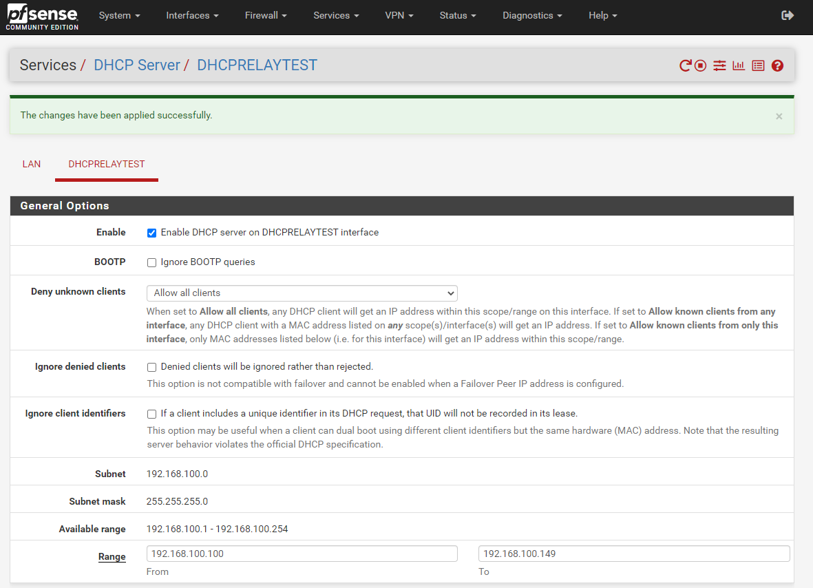

# Configuring a Cross VLAN DHCP Relay on SONiC OS

- [Configuring a Cross VLAN DHCP Relay on SONiC OS](#configuring-a-cross-vlan-dhcp-relay-on-sonic-os)
  - [My Configuration](#my-configuration)
    - [Test Concept](#test-concept)
    - [4112F-ON OS 10 Version](#4112f-on-os-10-version)
    - [Z9264 SONiC Version](#z9264-sonic-version)
  - [Configuration of Devices](#configuration-of-devices)
    - [OS10 on 4112F-ON](#os10-on-4112f-on)
    - [SONiC OS on Z9264](#sonic-os-on-z9264)
      - [Helpful Commands](#helpful-commands)
    - [Configuration on ESXi](#configuration-on-esxi)
    - [Configuration on PFSense](#configuration-on-pfsense)

## My Configuration

Dell 4112F-ON running OS 10 (interface eth1/1/13 to interface ethernet 0 [all VLAN 99])
            |
Dell Z9264 running SONiC OS (interface ethernet 257 to interface vmnic7 [all vlan 100])
            |
Dell VEP 1485 running ESXi (virtual switch with portgroup on vlan 100 going to VM's virtual NIC)
            |
PFSense Virtual Machine with DHCP server

DHCP Server IP address 192.168.100.1

### Test Concept

DHCP request will go from SVI interface on 4112F-ON residing on VLAN 99 through the Z9264, to ESXi, and onto the DHCP server running on the PFSense virtual machine on VLAN 100

### 4112F-ON OS 10 Version

```
Dell EMC Networking OS10 Enterprise
Copyright (c) 1999-2020 by Dell Inc. All Rights Reserved.
OS Version: 10.5.1.3
Build Version: 10.5.1.3.190
Build Time: 2020-06-19T21:48:07+0000
System Type: S4112F-ON
Architecture: x86_64
Up Time: 1 day 01:29:03
```

### Z9264 SONiC Version

```
Software Version  : '3.4.0-Enterprise_Base'
Product           : Enterprise SONiC Distribution by Dell Technologies
Distribution      : '9.13'
Kernel            : '4.9.0-11-2-amd64'
Config DB Version : version_3_3_1
Build Commit      : 'e2f258af7'
Build Date        : Wed Jul 28 23:54:33 UTC 2021
Built By          : sonicbld@sonic-lvn-csg-005
Platform          : x86_64-dellemc_z9264f_c3538-r0
HwSKU             : DellEMC-Z9264f-C64
ASIC              : broadcom
Hardware Version  : A00
Serial Number     : TW0XXP63DNT008970001
Uptime            : 04:53:36 up 2:05, 1 user, load average: 1.04, 0.94, 0.95
Mfg               : Dell EMC
```

## Configuration of Devices

### OS10 on 4112F-ON

```
configure terminal
interface ethernet 1/1/13
switchport mode access
switchport access vlan 99
```

### SONiC OS on Z9264

```
sonic-cli
configure terminal
interface ethernet 0
no shutdown
fec rs
speed 100000
exit
interface ethernet 257
no shutdown
```

**NOTE**: I had to manually configure FEC to bring the interface up.

#### Helpful Commands

`show interface transceiver`

**NOTE**: Unlike OS10 all interfaces start in shutdown mode so you will need to bring them up.

### Configuration on ESXi


### Configuration on PFSense

