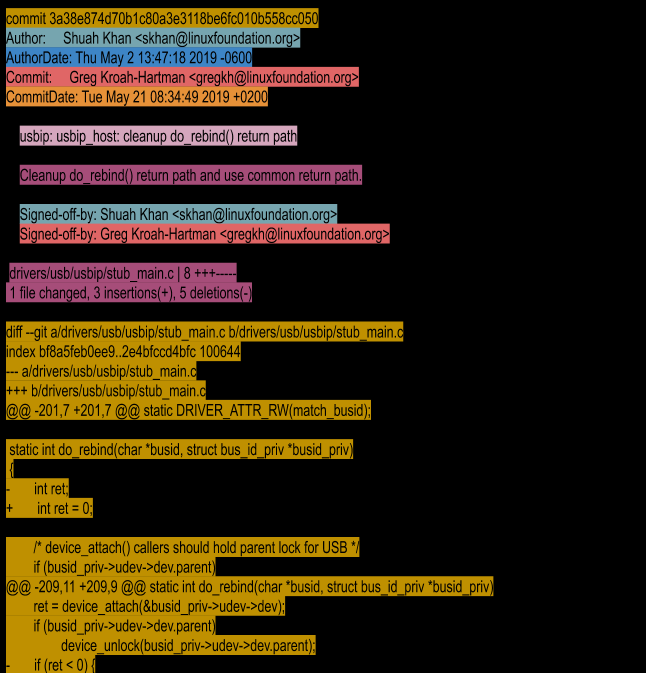

# Learning About Kernel Dev

## General Notes

- Releases happen every 10 to 11 weeks and are not based on features
- Linus opens a merge window of 2 weeks. All changes are pulled into the first release candidate known as rc1.
  - One week after RC1 is RC2 and after that RC3. These are bug fixes and these continue until all major bug fixes and regressions are resolved
  - After that is a quiet period of three weeks starting one week before the release and continues through a two week merge window.
- Kernel Trees
  - Mainline kernel tree: maintained by Linux Torvalds. This is where main linux comes from
  - Stable tree: Maintained by Greg Kroah-Hartman. Consists of stable release branches
  - linux-next tree: used for integration testing. Pulls changes from various trees catching merge conflicts between trees
  - One of Shuah's first actions as a maintainer was to request that her tree be added to linux-next. After she commits patches to her tree, Shuah waits 3 to 7 days before sending a pull request to Linus, giving enough time to find problems and regressions, if any. Patches applied to a tree that will be added to linux-next are only for the next merge window, including during the merge window. Patches for the next release may be added to linux-next after the merge window has closed, and the rc1 candidate has been released by Linus.
- Subsystem maintainers can be found in the [maintainer's file](https://www.kernel.org/doc/linux/MAINTAINERS)
  - Each system typically has a [mailing list](https://subspace.kernel.org/vger.kernel.org.html)
  - This is a non-exhaustive list of kernel.org git repos: https://git.kernel.org/
- More details are here https://www.kernel.org/doc/html/latest/process/development-process.html
- Each patch contains a change to the kernel that implements one independent modification that stands on its own. A patch cannot break the kernel build. 
  - For example, if you were to find an existing compile warning while making a code change, you would fix it independently in a separate patch instead of combining it with your code change.
- How to format a patch: `git format-patch -1 --pretty=fuller 3a38e874d70b`



Patch format:

> major subsystem: minor area: short description of what is being changed
> 
> As you can see in the example provided, the patch changes the usbip_host driver, which is a sub-driver of the usbip driver. This driver falls under the drivers/usb subsystem. The author of the patch writes this information in a standard format with ":" separating the major and minor subsystem fields. You will also see "/" as a separator, which would look like usbip/usbip_host: cleanup do_rebind() return path instead of usbip: usbip_host: cleanup do_rebind() return path. Using "/" or ":" is determined by the maintainer's preference. If in doubt, refer to a few patches for the subsystem for information on individual preferences.
- Patch subject line conventions: Let's find out how to prefix patch email subject lines. The [PATCH] prefix is used to indicate that the email consists of a patch. [PATCH RFC] or [RFC PATCH] indicates the author is requesting comments on the patch. RFC stands for "Request For Comments". [PATCH v4] is used to indicate that the patch is the 4th version of this specific change that is being submitted. It is not unusual for a patch to go through a few revisions before it gets accepted. This is an artifact of collaborative development. The goal is to get the code right and not rush it in.
- Example of patch versioning: https://patchwork.kernel.org/project/linux-kselftest/patch/20190926224014.28910-1-skhan@linuxfoundation.org/

## Setting Up Dev Box

```bash
sudo apt-get install -y build-essential vim git cscope libncurses-dev libssl-dev bison flex
sudo apt-get install -y git-email
```