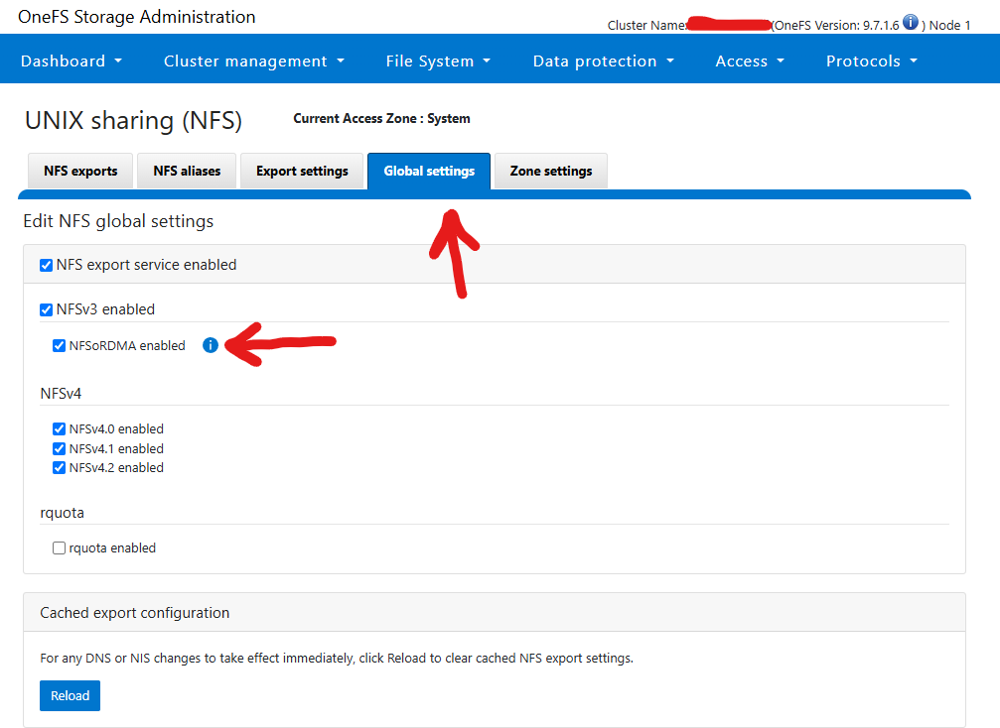

# Setup RoCE on PowerScale

- [Setup RoCE on PowerScale](#setup-roce-on-powerscale)
  - [Verify Hardware and Software Compatibility](#verify-hardware-and-software-compatibility)
    - [PowerScale Requirements](#powerscale-requirements)
    - [R7625 Client Requirements](#r7625-client-requirements)
  - [Configure the PowerScale Cluster](#configure-the-powerscale-cluster)
    - [Enable NFS over RDMA in OneFS](#enable-nfs-over-rdma-in-onefs)
    - [Set Access Pattern on Target Directories](#set-access-pattern-on-target-directories)
    - [Disabling Deduplication for Performance Testing](#disabling-deduplication-for-performance-testing)
  - [Configure the Network](#configure-the-network)
    - [3.1. Set Jumbo Frames](#31-set-jumbo-frames)
    - [3.2. Enable Flow Control on Switch Ports](#32-enable-flow-control-on-switch-ports)
  - [4. Mount the PowerScale Export Using RDMA](#4-mount-the-powerscale-export-using-rdma)
    - [4.1. Show Available NFS Exports](#41-show-available-nfs-exports)
    - [4.2. Create Mount Point](#42-create-mount-point)
    - [4.3. Mount Over RDMA](#43-mount-over-rdma)
  - [5. Verify RDMA Functionality](#5-verify-rdma-functionality)
    - [5.1. Check Protocol Used in Mount](#51-check-protocol-used-in-mount)
    - [5.2. Observe RDMA Traffic with tcpdump](#52-observe-rdma-traffic-with-tcpdump)
    - [5.3. Run fio to Generate I/O](#53-run-fio-to-generate-io)
  - [6. Optional: Real-World Application Verification](#6-optional-real-world-application-verification)
    - [6.1. Autodesk Flame 2022 Playback Test](#61-autodesk-flame-2022-playback-test)
    - [6.2. DaVinci Resolve Playback Test](#62-davinci-resolve-playback-test)
  - [7. Troubleshooting](#7-troubleshooting)
    - [7.1. No RDMA Device on Client](#71-no-rdma-device-on-client)
    - [7.2. Mount Fails with `permission denied`](#72-mount-fails-with-permission-denied)
    - [7.3. Poor Performance Despite RDMA](#73-poor-performance-despite-rdma)
  - [8. References](#8-references)


This tutorial walks through setting up NFS over RDMA between a Dell R7625 running Linux and a PowerScale cluster running OneFS 9.2 or later.

## Verify Hardware and Software Compatibility

### PowerScale Requirements

- Must be running OneFS version 9.2 or higher
- Must have Mellanox ConnectX-3 Pro or more recent NICs. As of writing in 2025 this should be any ConnectX NIC you buy.
- RDMA must be supported on the front-end interfaces

Run this on PowerScale CLI:
```bash
isi network interfaces list -v
````

Look for:

```
Flags: ... SUPPORTS_RDMA_RROCE ...
```

Ex:

```shell
IP Addresses: 192.168.4.19
            LNN: 5
        Name: 100gige-1
    NIC Name: mce2
        Owners: groupnet0.subnet0.pool2
        Status: Up
        VLAN ID: -
Default IPv4 Gateway: 192.168.4.254
Default IPv6 Gateway: -
            MTU: 1500
    Access Zone: System
        Flags: ACCEPT_ROUTER_ADVERT, SUPPORTS_RDMA_RRoCE
Negotiated Speed: 100Gbps
```

### R7625 Client Requirements

* Operating System: CentOS 7.9 or RHEL 7/8/9 (known to work)
* NIC: Mellanox ConnectX-3 or higher, or ATTO FastFrame3
* BIOS settings: Set to performance mode

Check RDMA device availability:

```bash
sudo dnf install rdma-core libibverbs-utils ethtool pciutils -y
ibv_devinfo
```

You should see something like this:

```
[grant@aj-objsc-01 ~]$ ibv_devinfo
hca_id: irdma0
        transport:                      InfiniBand (0)
        fw_ver:                         1.72
        node_guid:                      b683:51ff:fe02:7a30
        sys_image_guid:                 b683:51ff:fe02:7a30
        vendor_id:                      0x8086
        vendor_part_id:                 5531
        hw_ver:                         0x2
        phys_port_cnt:                  1
                port:   1
                        state:                  PORT_ACTIVE (4)
                        max_mtu:                4096 (5)
                        active_mtu:             1024 (3)
                        sm_lid:                 0
                        port_lid:               1
                        port_lmc:               0x00
                        link_layer:             Ethernet

hca_id: irdma1
        transport:                      InfiniBand (0)
        fw_ver:                         1.72
        node_guid:                      b683:51ff:fe02:7a31
        sys_image_guid:                 b683:51ff:fe02:7a31
        vendor_id:                      0x8086
        vendor_part_id:                 5531
        hw_ver:                         0x2
        phys_port_cnt:                  1
                port:   1
                        state:                  PORT_ACTIVE (4)
                        max_mtu:                4096 (5)
                        active_mtu:             1024 (3)
                        sm_lid:                 0
                        port_lid:               1
                        port_lmc:               0x00
                        link_layer:             Ethernet
```

Notice, the transport is Infiniband however, the **link_layer** is Ethernet. Don't be confused by this and tell the lab manager that there are no RDMA-capable Ethernet cards in the box. Not that I would do that. This happens because the original software stack was written for Infiniband and transport is hardcoded as Infiniband.

You can also confirm by running `rdma link show`

```shell
[grant@aj-objsc-01 ~]$ rdma link show
link irdma0/1 state ACTIVE physical_state LINK_UP netdev ens6f0
link irdma1/1 state ACTIVE physical_state LINK_UP netdev ens6f1
```

## Configure the PowerScale Cluster

### Enable NFS over RDMA in OneFS

Web UI path:

```
Protocol > UNIX Sharing (NFS) > Global Settings > Enable NFS over RDMA
```



CLI equivalent:

```bash
isi nfs settings global modify --enable-rdma true
```

### Set Access Pattern on Target Directories

TODO - do I want any of this stuff

For video files:

```bash
isi filepool policies modify <policy-name> --set-access-pattern streaming
```

For image sequences:

```bash
isi filepool policies modify <policy-name> --set-access-pattern streaming
```

Enable filename-based prefetch:

```bash
isi filepool policies modify <policy-name> --enable-prefetch true
```

### Disabling Deduplication for Performance Testing

In high-throughput or latency-sensitive scenarios such as benchmarking NFS over RDMA or supporting real-time media workflows, inline deduplication can add overhead that skews performance results. To ensure accurate measurement of raw storage performance, you may want to disable deduplication.

To disable inline deduplication:

```bash
isi dedupe inline settings modify --mode disabled
```

I recommend this with workloads that are:

* Write-intensive or IOPS-bound
* Using large, unique, or pre-compressed files (e.g., video frames, genomic data)
* Focused on maximizing client-side throughput rather than storage efficiency

## Configure the Network

### 3.1. Set Jumbo Frames

On all switch ports and server NICs:

```
MTU = 9000
```

Linux side:

```bash
ip link set dev <iface> mtu 9000
```

Verify:

```bash
ip link show <iface>
```

### 3.2. Enable Flow Control on Switch Ports

Refer to switch documentation to ensure flow control (pause frames) are enabled. RoCEv2 requires lossless Ethernet or ECN-capable switches.

## 4. Mount the PowerScale Export Using RDMA

### 4.1. Show Available NFS Exports

```bash
showmount -e <powerscale_ip>
```

### 4.2. Create Mount Point

```bash
mkdir -p /mnt/powerscale_rdma
```

### 4.3. Mount Over RDMA

```bash
mount -o rdma,proto=rdma <powerscale_ip>:/ifs/<export-path> /mnt/powerscale_rdma
```

Verify mount:

```bash
mount | grep /mnt/powerscale_rdma
```

## 5. Verify RDMA Functionality

### 5.1. Check Protocol Used in Mount

```bash
nfsstat -m
```

Look for:

```
proto=rdma
```

### 5.2. Observe RDMA Traffic with tcpdump

```bash
tcpdump -i <rdma_iface> port 20049
```

NFS over RDMA uses port 20049. Seeing traffic here confirms that RDMA is being used.

### 5.3. Run fio to Generate I/O

Create fio job file `read.fio`:

```ini
[global]
ioengine=libaio
direct=1
rw=read
bs=1m
numjobs=1
size=1G
directory=/mnt/powerscale_rdma

[job1]
name=readtest
```

Run:

```bash
fio read.fio
```

Compare results with RDMA vs TCP mount to confirm RDMA performance benefit.

## 6. Optional: Real-World Application Verification

### 6.1. Autodesk Flame 2022 Playback Test

* Mount PowerScale over RDMA on workstation
* Enable debug mode in Flame
* Play 4K/60fps or 8K/24fps media
* Compare dropped frames count over TCP vs RDMA

  * RDMA should show massive improvement (example: from 6000 dropped frames to 11)

### 6.2. DaVinci Resolve Playback Test

* Use 6K PIZ compressed EXR or 8K DPX sequences
* Observe playback smoothness and dropped frames
* Test with TCP mount, then repeat with RDMA

## 7. Troubleshooting

### 7.1. No RDMA Device on Client

* Check if OFED driver is installed
* Verify NIC compatibility
* Ensure no firewall or MTU mismatch

### 7.2. Mount Fails with `permission denied`

* Ensure NFS export is accessible from client IP
* Validate export permissions in OneFS UI or CLI

### 7.3. Poor Performance Despite RDMA

* Check that MTU and flow control are properly set
* Disable unnecessary system services
* Run `top` to check for CPU bottlenecks

## 8. References

* [PowerScale OneFS Best Practices](https://infohub.delltechnologies.com/section-assets/h16857-wp-onefs-best-practices)
* [How to Configure NFS over RDMA](http://www.unstructureddatatips.com/how-to-configure-nfs-over-rdma/)
* [Filename Based Prefetch White Paper](https://www.delltechnologies.com/asset/en-us/products/storage/industry-market/h16951-wp-isilon-file-name-pre-fetch.pdf)
* [Mellanox RoCE Tuning Guide](https://community.mellanox.com/s/article/roce-deployment-guide)
