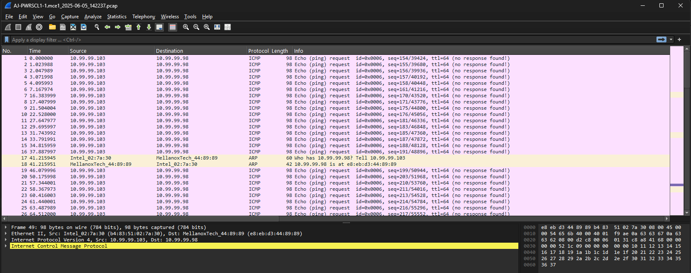

Customer is configuring RDMA with multipath client. Currently there is one LAG going from an R7625 to a Dell 5248F-ON. That LAG is in VLAN 1010. There are two single, 25Gb/s, cables running from nodes 1 and 2 respectively to the same 5248F-ON and both of those interfaces are also in VLAN 1010. The LAG for the R7625 is connected to eth 1/1/17 and 19 and the PowerScale interfaces are connected to ethernet 1/1/21 and ethernet 1/1/23. The R7625 has IP address 10.99.99.103/29 assigned to it:

```bash
[grantcurell-mapped@localhost ~]$ ip a s
1: lo: <LOOPBACK,UP,LOWER_UP> mtu 65536 qdisc noqueue state UNKNOWN group default qlen 1000
    link/loopback 00:00:00:00:00:00 brd 00:00:00:00:00:00
    inet 127.0.0.1/8 scope host lo
       valid_lft forever preferred_lft forever
    inet6 ::1/128 scope host
       valid_lft forever preferred_lft forever
2: eno8303: <BROADCAST,MULTICAST,UP,LOWER_UP> mtu 1500 qdisc mq state UP group default qlen 1000
    link/ether ec:2a:72:35:4e:fc brd ff:ff:ff:ff:ff:ff
    altname enp99s0f0
    inet 192.168.0.26/24 brd 192.168.0.255 scope global dynamic noprefixroute eno8303
       valid_lft 527896sec preferred_lft 527896sec
    inet6 fe80::ee2a:72ff:fe35:4efc/64 scope link noprefixroute
       valid_lft forever preferred_lft forever
3: eno8403: <NO-CARRIER,BROADCAST,MULTICAST,UP> mtu 1500 qdisc mq state DOWN group default qlen 1000
    link/ether ec:2a:72:35:4e:fd brd ff:ff:ff:ff:ff:ff
    altname enp99s0f1
4: ens6f0: <BROADCAST,MULTICAST,SLAVE,UP,LOWER_UP> mtu 9000 qdisc mq master bond0 state UP group default qlen 1000
    link/ether b4:83:51:02:7a:30 brd ff:ff:ff:ff:ff:ff
    altname enp161s0f0
5: ens6f1: <BROADCAST,MULTICAST,SLAVE,UP,LOWER_UP> mtu 9000 qdisc mq master bond0 state UP group default qlen 1000
    link/ether b4:83:51:02:7a:30 brd ff:ff:ff:ff:ff:ff permaddr b4:83:51:02:7a:31
    altname enp161s0f1
6: bond0: <BROADCAST,MULTICAST,MASTER,UP,LOWER_UP> mtu 9000 qdisc noqueue state UP group default qlen 1000
    link/ether b4:83:51:02:7a:30 brd ff:ff:ff:ff:ff:ff
    inet 10.99.99.103/29 brd 10.99.99.103 scope global noprefixroute bond0
       valid_lft forever preferred_lft forever
    inet6 fe80::3f2a:9a18:8c51:e4a5/64 scope link noprefixroute
       valid_lft forever preferred_lft forever
```

The PowerScale interfaces are on 10.99.99.97,98, and 102. 102 is the SmartConnect address.

```bash
AJ-PWRSCL1-1% isi network interfaces list --verbose

... SNIP...

        IP Addresses: 10.99.99.102, 10.99.99.98
                 LNN: 1
                Name: 25gige-2
            NIC Name: mce1
              Owners: groupnet0.grantsrdmasubnet, groupnet0.grantsrdmasubnet.grantsrdmapool
              Status: Up
             VLAN ID: -
Default IPv4 Gateway: -
Default IPv6 Gateway: -
                 MTU: 9000
         Access Zone: System
               Flags: SUPPORTS_RDMA_RRoCE
    Negotiated Speed: 25Gbps
--------------------------------------------------------------------------------
        IP Addresses: 10.99.99.97
                 LNN: 2
                Name: 25gige-2
            NIC Name: mce1
              Owners: groupnet0.grantsrdmasubnet.grantsrdmapool
              Status: Up
             VLAN ID: -
Default IPv4 Gateway: -
Default IPv6 Gateway: -
                 MTU: 9000
         Access Zone: System
               Flags: ACCEPT_ROUTER_ADVERT, SUPPORTS_RDMA_RRoCE
    Negotiated Speed: 25Gbps
```

You can ping with some success to 103 from the PowerScale:

```bash
AJ-PWRSCL1-1% !ping
ping 10.99.99.103
PING 10.99.99.103 (10.99.99.103): 56 data bytes
64 bytes from 10.99.99.103: icmp_seq=5 ttl=64 time=0.104 ms
64 bytes from 10.99.99.103: icmp_seq=7 ttl=64 time=0.082 ms
^C
--- 10.99.99.103 ping statistics ---
9 packets transmitted, 2 packets received, 77.8% packet loss
round-trip min/avg/max/stddev = 0.082/0.093/0.104/0.011 ms
```

You cannot ping at all from the R7625:

```bash
[grantcurell-mapped@localhost ~]$ !ping
ping 10.99.99.98
PING 10.99.99.98 (10.99.99.98) 56(84) bytes of data.
^C
--- 10.99.99.98 ping statistics ---
9 packets transmitted, 0 received, 100% packet loss, time 8175ms
```

However, you from a `tcpdump` off of the PowerScale that ARP completes successfully and the pings are arriving:



However, no response is ever seen coming back from the PowerScale to the R7625 nor do I understand why most of the pings from the PowerScale fails.

That's current status.