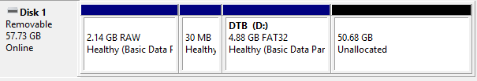

# Run Linux on Latitude 7455

- Download the Fedora ISO
- Install the minimal toolchain to build the device tree blob

```bash
sudo apt-get install -y git make device-tree-compiler gcc-aarch64-linux-gnu flex bison libelf-dev libssl-dev bc
```

- Clone the current Linux-next kernel
  - Most development happens in Linux-next

```bash
cd ~
git clone https://git.kernel.org/pub/scm/linux/kernel/git/next/linux-next.git
cd linux-next
git fetch --tags origin

# list July 2025 tags:
git tag -l "next-202507*"

# pick one around 2025-07-17; this is the one that worked for me:
git checkout -B bringup next-20250717
```

- Set up `b4`

```bash
sudo apt-get update
sudo apt-get install -y b4 || sudo apt-get install -y python3-b4
```

- Pull the latest Dell "Thena" series mbox
  - What we're doing here is grabbing a patch series from a mailbox file. A mailbox file contains the entire patch series as it was e-mailed in the Linux mailing list. The `git am` command applies mail - it reads the mbox and turns each email/patch into a commit on the local repo
  - Patchew is a web service that mirrors the Linux mailing list patches and gives us a clean download option
  - **You'll probably get little red Xs like this ✗.** You can ignore them. These are attestation checks for DKIM/signature verification but since mailing lists rewrite headers that breaks DKIM so you'll get these failed checks.
  - These are the in-flight patches I'm working from: https://lkml.org/lkml/2025/5/25/119

```bash
git config user.name "<YOUR NAME>"
git config --global user.email "<YOUR EMAIL>"
mkdir -p dell-7455-v4
b4 am -o dell-7455-v4 20250716003139.18543-1-val@packett.cool
git am dell-7455-v4/*.mbx 2>/dev/null || git am dell-7455-v4/*.mbox
```

- Build only the device trees (we're not building the kernel here):

```bash
make ARCH=arm64 CROSS_COMPILE=aarch64-linux-gnu- defconfig
make ARCH=arm64 CROSS_COMPILE=aarch64-linux-gnu- dtbs -j"$(nproc)"
ls arch/arm64/boot/dts/qcom/x1e80100-dell-latitude-7455.dtb
```

- The above `ls` command s hould confirm the device tree blob is present. If it isn't... that is unfortunate. I haven't written much troubleshooting because we're truly out on the bleeding edge here.
- If you haven't already, you will need to build a Fedora Live CD. You will need to build with the Partition Scheme set to GPT and the Target system UEFI (non CSM). When asked, do the write in DD mode.
  - DD mode writes the image bit-for-bit exactly as Fedora built it (partitions, boot sectors, EFI files, etc). ISO mode will "help" by rearranging som efiles or portations for Windows.


- Next go ahead and transfer your device tree file to the USB you just created. If Windows can't read it, then the way I solved this was to create a FAT32 partition in the unused space of my Fedora USB like this:



- Take note that I called the partition DTB! That's going to be important later.
- I then copied the DTB file there and called it 7455.dtb
- Next insert the USB stick in the target and boot. The boot menu for me looked a bit weird, select the top Fedora entry:

TODO - add the image

- Once you see GRUB, hit `c` to enter the command prompt.
- Run the below to load the modules you need:

```bash
insmod part_gpt
insmod fat
insmod fdt
```

- Next we need to find our device tree blob. If you just run `ls` you're going to see a lot and it will take forever to find:


- The way we get around this is running `search -l DTB -s dtb`. That will find the partition called DTB and put it in the variable `$dtb`. You can run `echo $dtb` to see the variable and from there can confirm:

```bash
ls ($dtb)/
System Volume Information 7455.dtb
```

- Now go ahead and add your device tree with:
  - If you named your dtb file you'll need to adjust the command below

```bash
devicetree ($dtb)/7455.dtb
normal  # This will take us back to Fedora
```

## TODO


This is where I got stuck and haven't continued. I was able to get everything to build with the regular build of Fedora 42-1.1 AARCH64. However, it dies at the graphics handoff. I tried forcing text and it just black screened.

I also tried Rawhide, but Rawhide didn't even bring up GRUB. I didn't fiddle with it much though.

On regular I tried the following kernel options with GRUB and booting:

### Regular Boot

```bash
earlycon keep_bootcon ignore_loglevel
```

### Text Only Mode

```bash
earlycon keep_bootcon ignore_loglevel loglevel=8 systemd.log_level=debug systemd unit=multi-user.target nomodeset
```

### Text Only Mode and Blocking the `msm` Driver

```bash
earlycon keep_bootcon ignore_loglevel loglevel=8 systemd.log_level=debug systemd.unit=multi-user.target modprobe.blacklist=msm
```