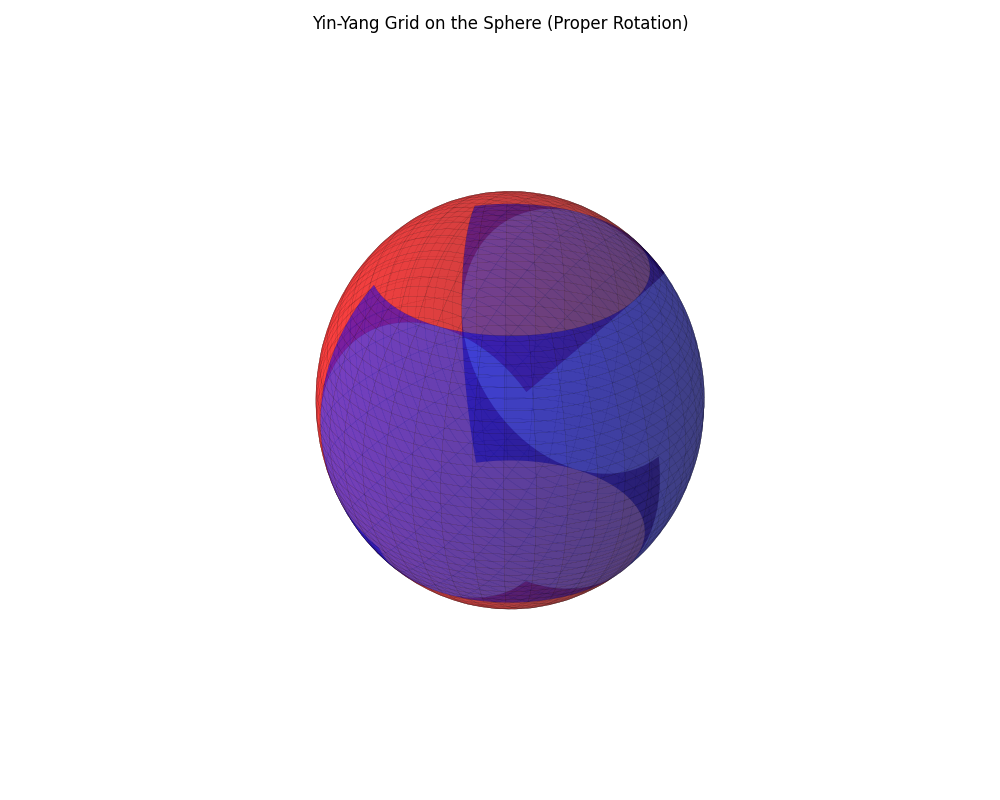
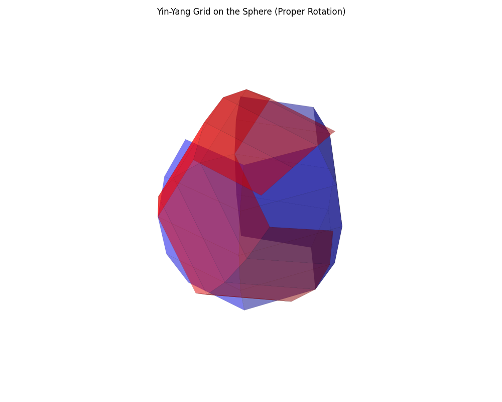

## What is Global Environmental Multiscale (GEM) model

- [What is Global Environmental Multiscale (GEM) model](#what-is-global-environmental-multiscale-gem-model)
- [Background](#background)
  - [What are we doing here?](#what-are-we-doing-here)
  - [How are we going to do that?](#how-are-we-going-to-do-that)
  - [Ok, but **how** does GEM do that?](#ok-but-how-does-gem-do-that)
  - [What is a Domain](#what-is-a-domain)
- [Understanding the Benchmark](#understanding-the-benchmark)
  - [Understanding Grids](#understanding-grids)
    - [Global Yin-Yang Grid](#global-yin-yang-grid)
    - [LAM Uniform Grid](#lam-uniform-grid)
- [Understanding ptopo](#understanding-ptopo)
  - [`runmod.sh`](#runmodsh)
  - [`setmod.sh`](#setmodsh)
  - [`rungem.sh`](#rungemsh)
- [Understanding Grid Decomposition (TODO)](#understanding-grid-decomposition-todo)
    - [High-level flow (annotated with the key code lines)](#high-level-flow-annotated-with-the-key-code-lines)
    - [Why it matters in the model run](#why-it-matters-in-the-model-run)
- [Install the Benchmark](#install-the-benchmark)
  - [Install Prerequisites](#install-prerequisites)
  - [Install `librmn`](#install-librmn)
  - [Install `sverif`](#install-sverif)
  - [Clone and Build GEM (Method 2)](#clone-and-build-gem-method-2)
  - [Verify the Work Directory](#verify-the-work-directory)
- [Run the Benchmark](#run-the-benchmark)
  - [Using `findtopo`](#using-findtopo)
  - [Running in a New Environment](#running-in-a-new-environment)


## Background

### What are we doing here?

Given how heady weather is, I think it's best to start with a problem statement that gets at the heart of what GEM does.

> Given the current state of the atmosphere, what will be the future weather hours or weeks from now across different parts of the world.

### How are we going to do that?

We collect a bunch of observational data from different sources - satellites, weather balloons, surface stations, radar, aircraft - all sorts of stuff - we shove it all into a big equation and then we guess. This is called numerical weather prediction.

### Ok, but **how** does GEM do that?

> NUMERICAL TECHNIQUES
> - Horizontal variable-resolution cell-integrated finite-element discretization reducing to the usual staggered finite differences discretization at uniform resolution in spherical geometry.
> - Semi-implicit semi-Lagrangian time discretization scheme which removes the overly- restrictive time step limitation imposed by the use of a more conventional Eulerian scheme.
> - Hydrostatic-pressure-type hybrid vertical coordinate.

Clear? If your reaction was like mine, probably not. I spent a lot of time reading to wrap my head around this so I'll break it down for you.

> "Horizontal variable-resolution cell-integrated finite-element discretization"

The model breaks the land and atmosphere into grid cells, like tiles on a map — but the cells can be smaller where you want more detail, like over mountains or cities, and larger where less precision is fine, like over the open ocean. *Cell-integrated* means we calculate the averages over each tile. You can imagine that over the tile there are all sorts of different values, but ultimately, while it reduces our accuracy a bit, we can instead take the average of all of them and use that. Obviously, the smaller the tile, the more accurate we get. *Finite-element* is a method for solving equations. If we have some irregular shape, we break it down into several simple shapes - e.g. a triangle. Once we have a bunch of triangles, we then solve the equation for each of those triangles instead, then we connect all  the pieces together, and then solve those simple equations.

> "the usual staggered finite differences discretization"

Ah yes, *the usual*. Usual here being subjective. Ok, this is a lot of math speak that basically means we would usually do a bunch of partial differentials to calculate the value. The problem is that calculating partial derivatives is expensive. What we do instead is look at all the weather and instead of calculating derivatives, we just look at what is happening nearby and calculate the delta between two points. While this is less accurate than calculating the derivative it is much faster.

> "in spherical geometry"

This one is a bit more straightforward. The Earth isn't flat (probably). GEM's math has to account for that. Ex: if wind is blowing long distances it has to curve; it doesn't blow straight.

> "Semi-implict semi-Lagrangian time discretization scheme"

There are two ways we can evaluate a fluid - Lagrangian and Eulerian. Lagrangian means you follow the fluid as it moves, taking measurements as you go whereas Eulerian is the opposite. The "observer" is stationary and it takes measurements as the fluid moves past it. The semi-implicit part gets deep into math so I don't explain it fully here. What matters is that whether has a lot of things which happen quickly. For example, maybe you have a sudden gust of wind. Well the problem is if you assume that the wind is **always** moving at the gust's speed you end up being wildly wrong. You kinda want to pay attention to the gust of wind; you want the average of all the gusts basically, but you wouldn't want to just assume the wind is always gusting. That's what the semi-implicit is doing. It helps smooth all that out. You could potentially avoid this problem by taking a huge number of measurements. For example, you could check the wind speed every half second, but then your simulation becomes extremely expensive. Ideally, we would rather only calculate what's happening at larger intervals, for example, 10 minutes.

> "Hydrostatic-pressure-type hybrid vertical coordinate"

The vertical layers in GEM are not just at fixed heights. Near the surface, the layers more or less follow the terrain (mountains and valleys for example). However, higher up, they become more like flat slices of constant pressure. That's why it's a hybrid system. It blends terrain-following near the ground with pressure levels aloft.

### What is a Domain

A domain is a spatial subdomain of the earth's atmosphere over which the model will compute equations independently. Ultimately, we want to solve for the entire atmosphere, but that's complicated, so instead we break it down into smaller subdomains. A domain corresponds in our code to a set of configuration files listed under `TASK_INPUT/cfg_XXXX` ex: `cfg_0000`, `cfg_0001`... etc. (TODO check this). This is a specific area of execution.

## Understanding the Benchmark

### Understanding Grids

One of the first things we have to deal with is that the atmosphere is continuous, but computers aren't so we have to set up our problem to run on processors. We do this by turning the earth into one giant grid coordinate system. These are documented [here](https://wikienseignement.uqam.ca/display/EDDSDLTEL/namelists%3A+GEM+5.0).

#### Global Yin-Yang Grid

The yin-yang grid exists to tackle the problem of the poles. When you think about longitude and latitude, what happens is that as you approach the poles the grid boxes created by the lat / longs shrinks significantly. This causes their aspect ratio to skew high leading to numerical instability (when numbers get really really big or way too small in your equations) along with a bunch of other math problem. Effectively what happens is the model sort of falls apart. To avoid this we make two grids that look like this:



I wrote this code to allow you to visualize how changing `Grdc_ni` and `Grdc_nj` will impact the sphere. What you see above is with both set to 60. Here is what it would look like if you set both to 5:



Notice, what you are changing is the number of "grid lines". You can count them out and see that there are 5 with a total of four cells.

This eliminates the problem of singularities near the pole, gives us a uniform resolution, and makes it so we can easily break the problem down in parallel.

#### LAM Uniform Grid

TODO

TLDR: it's a small, rectangular, lat-long, grid used for regional simulations.

## Understanding ptopo

### `runmod.sh`

First you run `runmod.sh`. `cclargs_lite` breaks down the arguments and then everything is split into components with:


```bash
npex=$(echo ${ptopo} | cut -d "x" -f 1)
npey=$(echo ${ptopo} | cut -d "x" -f 2)
nomp=$(echo ${ptopo} | cut -d "x" -f 3)
npex=${npex:-1}
npey=${npey:-1}
nomp=${nomp:-1}
```

Where `npex` is the number of MPI processes along the x axis, `npey` is the number of processes along the Y axis, and `nomp` is the number of OpenMP threads per MPI rank. This will default to 1 if anything is missing. `_npe` is a derived value calculated by `_npe=$((npex*npey))` containing the total number of MPI ranks.

This all then gets fed into the domain calculation:

```bash
export CCARD_ARGS="-dom_start ${DOM} -dom_end ${last_domain} -dom_last ${DOMAIN_end} -npex ${npex} -npey ${npey} -ngrids ${ngrids} -smtdyn $smtdyn -smtphy $smtphy -along_Y ${alongYfirst} -input ${TASK_INPUT} -output ${TASK_OUTPUT}"
```

where:

| Argument                  | Description                                                                                                                        |
| ------------------------- | ---------------------------------------------------------------------------------------------------------------------------------- |
| `-dom_start ${DOM}`       | Starting index of the domain range that this invocation will process.                                                              |
| `-dom_end ${last_domain}` | Ending index of the domain range (inclusive).                                                                                      |
| `-dom_last ${DOMAIN_end}` | Final possible domain index; used to check bounds or stop conditions.                                                              |
| `-npex ${npex}`           | Number of MPI processes (ranks) along the X dimension of the decomposition grid.                                                   |
| `-npey ${npey}`           | Number of MPI processes (ranks) along the Y dimension.                                                                             |
| `-ngrids ${ngrids}`       | Number of physical grids per domain. E.g., `2` if `GRDTYP == GY` (Yin-Yang grid), otherwise `1`.                                   |
| `-smtdyn $smtdyn`         | SMT dynamic (logical thread-level parallelism). Refers (TODO) to how many logical threads are used dynamically (often 0 = off). |
| `-smtphy $smtphy`         | SMT physical. The number of physical SMT threads per core (relevant on AIX or similar systems).                                    |
| `-along_Y ${alongYfirst}` | Whether the PE layout prioritizes Y-axis first in the grid (value is `.true.` or `.false.`).                                       |
| `-input ${TASK_INPUT}`    | Path to input files for the model (namelists, settings, etc).                                                                      |
| `-output ${TASK_OUTPUT}`  | Path where model output files will be written.                                                                                     |


Finally, we call `rungem.sh`:

```bash
printf "\n LAUNCHING rungem.sh for domain: cfg_${domain_number} $(date)\n\n"
. r.call.dot ${TASK_BIN}/rungem.sh \
  -npex $((npex*ngrids)) -npey $npey -nomp $nomp \
  -nodespec ${nodespec} \
  -dom_start ${DOM} -dom_end ${last_domain} -debug $debug \
  -barrier ${barrier} -inorder ${inorder}
```

### `setmod.sh`

TODO

### `rungem.sh`

All of our arguments from [runmod.sh](#runmodsh) are passed and parsed here:

```bash
eval `cclargs_lite -D "" $0 \
  -npex      "1"     "1"     "[Block partitioning along-x     ]"\
  -npey      "1"     "1"     "[Block partitioning along-y     ]"\
  -nomp      "1"     "1"     "[Number of OMP threads          ]"\
  -nodespec  "NoNe"  "NoNe"  "[Node distribution specification]"\
  -dom_start "1"     "1"     "[Starting domain number         ]"\
  -dom_end   "1"     "1"     "[Ending domain number           ]"\
  -inorder   "0"     "5"     "[Ordered listing                ]"\
  -barrier   "0"     "0"     "[DO NOT run binary              ]"\
  -debug     "0"     "gdb"   "[Debug option: gdb, ddt         ]"\
  -_status   "ABORT" "ABORT" "[return status                  ]"\
  -_endstep  ""      ""      "[return last time step performed]"\
  ++ $arguments`
```

where:

| Argument     | Used in rungem.sh                                                            | Description |
| ------------ | ---------------------------------------------------------------------------- | ----------- |
| `-npex`      | Used to compute `npe_total` and passed to `r.mpirun`.                      |             |
| `-npey`      | Used as 2D topology height (Y-axis).                                       |             |
| `-nomp`      | Used to set `OMP_NUM_THREADS`.                                             |             |
| `-nodespec`  | Passed to `r.mpirun` as node layout specification.                         |             |
| `-dom_start` | Starting domain index (`idom` loop).                                       |             |
| `-dom_end`   | Ending domain index.                                                       |             |
| `-inorder`   | Controls how `r.mpirun` prints output. Enables `-inorder -tag -minstdout`. |             |
| `-barrier`   | If set, skips actual run and calls `r.barrier` for sync only.              |             |
| `-debug`     | If set (e.g., `gdb`, `ddt`), passes `-debug` to `r.mpirun`.                |             |
| `-_status`   | Used as return flag, updated post-run.                                     |             |
| `-_endstep`  | Not referenced in this script, likely used externally. (TODO)                     |             |

Next we calculate the number of domains and then the total number of MPI ranks. `npe_total` can be ignored, it is only used in some print output.

```bash
ndomains=$((dom_end - dom_start + 1))
npe_total=$(( npex * npey * ndomains ))
```

Set the number of OpenMP threads:

```bash
export OMP_NUM_THREADS=$nomp
```

Finally, we construct the run command:

```bash
CMD="${TASK_BIN}/r.mpirun -pgm ${TASK_BIN}/ATM_MOD.Abs -npex $((npex*npey)) -npey $ndomains $INORDER -nodespec ${nodespec} -minstdout ${inorder} -nocleanup"
```

As you start looking at this, there are some things that stick out as confusing. First, what is `r.mpirun` - you may notice it isn't part of the codebase. It is [gem_mpirun.sh](https://github.com/ECCC-ASTD-MRD/gem/blob/master/scripts/gem_mpirun.sh) it is just a copy that gets moved into your work directory.

`pgm` is the program to run. In this case we inject `ATM_MOD.Abs` which is the main GEM atmosphere executable produced by the build system. Ex:

```bash
[grant@rockyvm1 gem]$ find ./ -iname *ATM_MOD*
./work-RockyLinux-9.5-x86_64-gnu-11.5.0/RUNMOD/bin/ATM_MOD.Abs
```

Next are `npex` and `npey` which at this point you are roughly familiar with. You might ask why is `npex` set to `$((npex*npey))` and `npey` only set to `ndomains`? Keep in mind that `r.mpirun` can only build a 2D, cartesian communicator, but GEM needs three logical axes: 

```bash
WORLD-X  = npex × npey          ← passed as –npex
WORLD-Y  = ndomains             ← passed as –npey
```

You can think of what is happening here as flattening:

```bash
X  (columns)      = npex
Y  (rows)         = npey
Z  (domains/nests)= ndomains
```

They are later unflattened internally in the code base.

`-nodespec` - This is interpreted by `r.run_in_parallel` which seems to be a convienience script written by EC. `nodespec` will allow you to pass things like `skylake:48` to help provide architecture hints.

`minstdout` is empty by default and controls the amount of output. It just makes sure you don't overwhelm with log volume on large runs.

`nocleanup` stops the script from deleting any temporary files in `TASK_WORK` for debug purposes.

## Understanding Grid Decomposition (TODO)


Grid decomposition occurs in `src/base/domain_decomp.F90`. The purpose of this function is to take `G_ni` and `G_nj` and decompose them into a `Ptopo_npex × Ptopo_npey` processor grid

`domain_decomp` is GEM’s **initial domain-partitioning routine**.
It slices the global horizontal mesh *(G\_ni × G\_nj)* into a , assigns each MPI rank its local tile size and starting indices, and stores those numbers in the global **glb\_ld** module where every solver loop can reach them.

---

#### High-level flow (annotated with the key code lines)

| Step                                  | File lines                                            | What happens                                                                                                                                                                                                                                   |
| ------------------------------------- | ----------------------------------------------------- | ---------------------------------------------------------------------------------------------------------------------------------------------------------------------------------------------------------------------------------------------- |
| **0. Initialise**                     | `errno = -1`                                          | Assume failure until both directions succeed.                                                                                                                                                                                                  |
| **1. Log request**                    | `write (Lun_out,1000) G_ni,F_npex,G_nj,F_npey`        | Prints “DOMAIN\_DECOMP: checking partitioning …”.                                                                                                                                                                                              |
| **2. Decompose X (i-direction)**      | first call to `decomp` (lines 24-30)                  | Passes global `G_ni`, halo width `Grd_extension+1`, desired sub-domains `F_npex`; receives:<br>• `l_minx,l_maxx` (halo-inclusive local bounds)<br>• `lnis(:)` (local x-sizes for every column of ranks)<br>• `l_i0` (my first global i index). |
| **3. Decompose Y (j-direction)**      | second call to `decomp` (lines 30-34)                 | Same for `G_nj`, returns `l_miny,l_maxy`, `lnjs(:)`, `l_j0`.                                                                                                                                                                                   |
| **4. Global success check**           | `rpn_comm_Allreduce`                                  | Reduces `errno` across all ranks (MPI MIN) → function value `domain_decomp`.                                                                                                                                                                   |
| **5. Abort on error**                 | `if (domain_decomp < 0)`                              | Logs “ILLEGAL DOMAIN PARTITIONING” and exits.                                                                                                                                                                                                  |
| **6. Store local sizes**              | `l_ni = lnis(1)`<br>`l_nj = lnjs(1)`<br>`l_nk = G_nk` | Those `l_*` variables live in module **glb\_ld**; every dynamics/physics loop uses them.                                                                                                                                                       |
| **7. Derive edge-adjusted extents**   | `l_njv, l_niu` with `if (l_north) …`                  | Handles polar or east-edge staggering quirks.                                                                                                                                                                                                  |
| **8. Optional global-position table** | `if (.not.F_checkparti_L) call glbpos()`              | Builds look-up arrays mapping each rank’s tile to its position.                                                                                                                                                                                |
| **9. Debug print per rank**           | `write(Lun_out,2000) …`                               | Shows `(myrow,mycol)`, local size, and global i/j span.                                                                                                                                                                                        |

---

#### Why it matters in the model run

* **Load balancing:** The helper function `decomp` chooses tile sizes so that each rank processes either ⌈N/P⌉ or ⌊N/P⌋ points (“ALLEQUALLBUT1” or “MOSTUNIFORM” strategy).
* **Halo awareness:** The extra argument `(Grd_extension+1)` guarantees every tile owns enough guard-cells for its numerical stencil.
* **One-time operation:** After `domain_decomp` succeeds, all subsequent memory allocation (`mem_tstp`, `mem_tracers`) and main loops (`dynstep`, `itf_phy_step`) rely on the local sizes and indices it recorded.

In short, `domain_decomp` turns the **one big global grid** defined by the namelist into **576 (or however many) non-overlapping halo-padded tiles** and tells each MPI rank, *“These are the i/j rows you own.”*


## Install the Benchmark

### Install Prerequisites

```bash
# Enable EPEL and CRB (or PowerTools) repositories
sudo dnf install -y epel-release
sudo dnf config-manager --set-enabled crb || sudo dnf config-manager --set-enabled powertools

# Install development tools and general build dependencies
sudo dnf groupinstall -y "Development Tools"
sudo dnf install -y \
  gcc \
  gcc-c++ \
  gcc-gfortran \
  cmake \
  git \
  make \
  pkgconf \
  which \
  expat \
  expat-devel \
  texinfo \
  doxygen \
  libxml2-devel \
  fftw-devel \
  netcdf \
  netcdf-devel \
  netcdf-fortran \
  netcdf-fortran-devel \
  hdf5 \
  hdf5-devel \
  blas \
  blas-devel \
  lapack \
  lapack-devel

# Install MPI (OpenMPI)
sudo dnf install -y openmpi openmpi-devel

# Add OpenMPI to shell path (permanent)
echo 'export PATH=/usr/lib64/openmpi/bin:$PATH' >> ~/.bashrc
echo 'export LD_LIBRARY_PATH=/usr/lib64/openmpi/lib:$LD_LIBRARY_PATH' >> ~/.bashrc
source ~/.bashrc
```

### Install `librmn`

```bash
cd ~
git clone https://github.com/ECCC-ASTD-MRD/librmn.git
cd librmn
git checkout alpha
git submodule update --init --recursive

mkdir build
cd build
cmake -DCMAKE_INSTALL_PREFIX=$HOME/librmn-install ..
make -j$(nproc)
make install
```

### Install `sverif`

```bash
cd ~
git clone https://github.com/ECCC-ASTD-MRD/sverif.git
cd sverif
git submodule update --init --recursive

mkdir build
cd build
cmake -Drmn_ROOT=$HOME/librmn-install -DCMAKE_INSTALL_PREFIX=$HOME/sverif-install ..
make -j$(nproc)
make install

# Add to PATH (permanent)
echo 'export PATH=$HOME/sverif-install/bin:$PATH' >> ~/.bashrc
export PATH=$HOME/sverif-install/bin:$PATH
```

### Clone and Build GEM (Method 2)

```bash
cd ~
git clone https://github.com/ECCC-ASTD-MRD/gem.git
cd gem
git checkout benchmark-5.3
git submodule update --init --recursive

# Download necessary databases for model execution and benchmarking
./download-dbase.sh .
./download-dbase-benchmarks.sh .

# Set up environment (use "gnu" unless you know otherwise)
. ./.common_setup gnu

# Use Method 2: Set up architecture-specific build + work directories
. ./.initial_setup

# Compile GEM with architecture detection
# cado is a custom script unique to gem
cado cmake
cado work -j
```

---

### Verify the Work Directory

Check that `work-[OS]-[COMPILER]` was created:

```bash
ls work-*
```

## Run the Benchmark

### Using `findtopo`

```bash
findtopo   -npex_low 1 -npex_high 96   -npey_low 1 -npey_high 96   -omp 1   -smt 1   -corespernode 32   -nml configurations/GEM_cfgs_GY_4km/cfg_0000/gem_settings.nml > topo.txt
```

- TODO explain what all this is doing

### Running in a New Environment

```bash
# Step 1: Go to the GEM source directory
cd ~/gem   # Or wherever you cloned the repo

# Step 2: Source the compiler environment
. ./.common_setup gnu

# Step 3: Set GEM_WORK and switch to the working dir
cd work-RockyLinux-9.5-x86_64-gnu-11.5.0
export GEM_WORK=$(pwd)
export GOAS_SCRIPT=""

# Step 4: Run with small topology (1x1x1)
../scripts/runmod.sh -dircfg configurations/GEM_cfgs_GY_4km -ptopo 1x1x1
```
