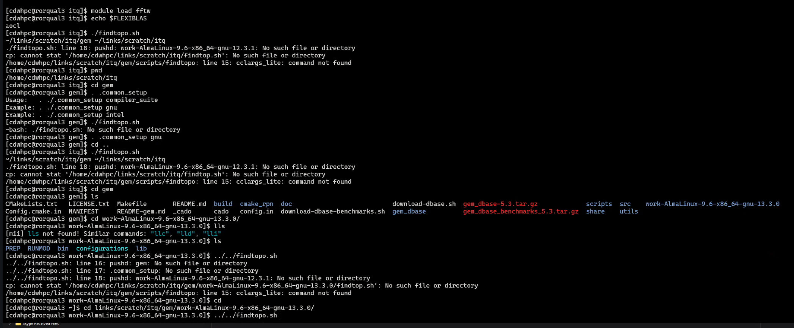
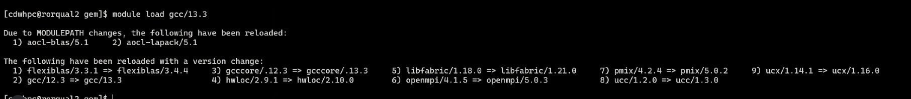
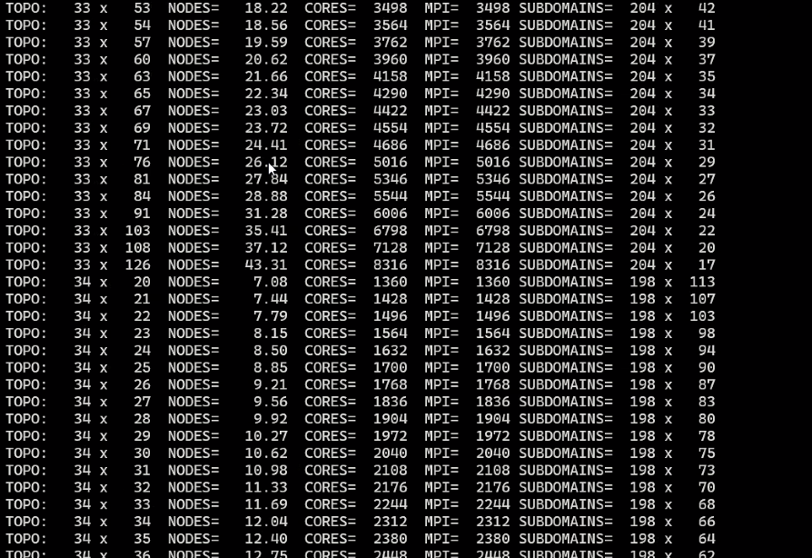
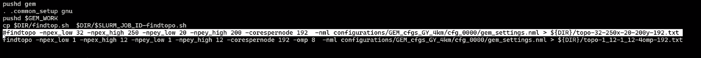
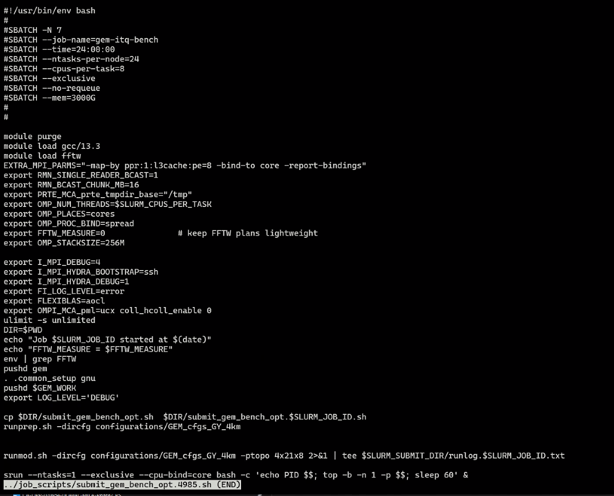
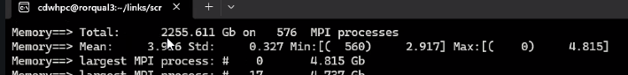

## Other Notes

- An analysis file is a snapshot of the initial state of the weather that we're going to use for our benchmark
- This page might be helpful for defining variables: https://collaboration.cmc.ec.gc.ca/science/rpn/gem/gemdm/revisions_doc/v_3.3.0/gem_settings.nml.txt
- This is what the guy did on the cluster



- So he is running findtopo across all the nodes



- This is what working looks like:





working was 2240, 



- Doubling G_nj, quadruples memory

## Math

- Total grid is going to be `Grd_ni x Grd_nj`
- Memory guess? `Memory = ni × nj × nk × n_fields × 8 bytes`

### Example Runs

- Grd_nj was 896



### FORMULAE

Symbols

```
N_i     = Grd_ni        ! global points in the i-direction
N_j     = Grd_nj        ! global points in the j-direction
N_k     = G_nk          ! vertical levels   (from &vert_layers)
H       = Grd_extension+1  (halo width; constant for a given build)
F       = number of 3-D fields that live in memory simultaneously
B       = bytes per array element (8 for REAL*8, 4 for REAL*4)
P       = Inp_npes      ! total MPI ranks you ask for
P_x,P_y = Ptopo_npex,Ptopo_npey   ! 2-D processor grid (see namelist)
```

Partitioning (taken directly from `partition.F90` and
`domain_decomp.F90`)

```
n_i  = ceil(N_i / P_x)          ! local i-size on one rank
n_j  = ceil(N_j / P_y)          ! local j-size on one rank
```

Memory per rank

```
M_rank  ≃  F · (n_i+2H) · (n_j+2H) · N_k · B      ........  Θ( N_i N_j N_k / P )
```

Total memory

```
M_total ≃  F · (N_i+2H) · (N_j+2H) · N_k · B      ........  Θ( N_i N_j N_k )
```

Floating-point operations per time-step (from the triple loops in
`dynstep.F90` and the physics column loop in `itf_phy_step.F90`)

```
Flops_step ≃  C · N_i · N_j · N_k                 ........  Θ( N_i N_j N_k )
```

`C` is a constant that bundles the fixed dynamical stencil cost and
physics cost per grid point.

If `N_i` stays fixed and you vary **Grd\_nj**, both memory and CPU time
scale linearly with `Grd_nj`.
If the grid is quasi-square (typical Yin-Yang GY case, so `N_i ≈ α N_j`)
then both scale quadratically with **Grd\_nj**.

---

#### WHERE EACH SYMBOL IS DEFINED IN THE CODE

* `G_ni`, `G_nj`                – set in `set_grid.F90` then stored in module variables read by `domain_decomp.F90`.
* `(n_i,n_j)`                   – calculated in `partition.F90`, line with `val1 = (F_npts + npe - 1)/npe`.
* `H`                           – the argument `(Grd_extension+1)` passed to `decomp` call inside `domain_decomp.F90`.
* `F`                           – count the `ALLOCATE` statements of 3-D arrays in
  `mem_tstp.F90`, `mem_tracers.F90`, `mem_nest.F90`, plus physics work arrays in `itf_phy_*`.  The count is constant for a given physics/dynamics choice.
* `B`                           – the declarations of those arrays (`REAL(KIND=dp)` ⇒ 8 bytes, `REAL(sp)` ⇒ 4 bytes).

---

## CHECK–LIST TO BUILD A QUICK NUMERIC ESTIMATE

1. Record the global sizes printed at run start
   (`DOMAIN_DECOMP: checking partitioning of G_ni and G_nj`).

2. Decide the processor grid
   (`P_x × P_y = Inp_npes`).  GEM defaults to a near-square grid.

3. Pick a halo width: `grep Grd_extension` in your namelists or code.
   It is usually 2 for 4-km GY.

4. Count `F`:
   `grep -R "ALLOCATE(.*, (NI_LOC" src/gemdyn/src | wc -l`
   (or just assume \~8–10 if you only need an order-of-magnitude).

5. Plug into the formulae above.

---

#### EXAMPLE  (your 4-km GY run)

```
N_i = 1152 ,  N_j = 896 , N_k = 140
P   = 576   →  P_x = P_y = 24
H   = 2
F   ≈ 8        (from mem_* allocation count)
B   = 8 bytes  (double precision)

n_i = ceil(1152 / 24) = 48
n_j = ceil( 896 / 24) = 38

M_rank  ≈ 8 · (48+4) · (38+4) · 140 · 8  ≈  3.9 GiB
M_total ≈ 3.9 GiB × 576 ≈ 2.2 TiB
```

Those match the numbers printed in your run (`Mean 3.9 Gb`, `Total
2256 Gb`).

---

#### KEY TAKE-AWAY

Memory and CPU cost in GEM are Θ(Grd\_ni × Grd\_nj × G\_nk).
Once you know the processor grid (`P_x, P_y`) you can translate that
directly into per-rank requirements with the simple tile formula above.

## Getting it Working at TACC

```bash
module load gcc/13.2.0
module load cmake/3.31.5
module load fftw3/3.3.10

git clone --branch benchmark-5.3 --recursive https://github.com/ECCC-ASTD-MRD/gem.git
cd gem
git submodule update --init --recursive
./download-dbase.sh .
./download-dbase-benchmarks.sh .
. ./.common_setup gnu
cado cmake
cado work -j
```

### Install `librmn`

```bash

mkdir build
cd build
cmake -DCMAKE_INSTALL_PREFIX=/work/10644/grantcurell/gem/librmn-install ..
make -j$(nproc)
make install
```

### Install `sverif`

```bash
cd ~
git clone https://github.com/ECCC-ASTD-MRD/sverif.git
cd sverif
git submodule update --init --recursive

mkdir build
cd build
cmake -Drmn_ROOT=$HOME/librmn-install -DCMAKE_INSTALL_PREFIX=$HOME/sverif-install ..
make -j$(nproc)
make install

# Add to PATH (permanent)
echo 'export PATH=$HOME/sverif-install/bin:$PATH' >> ~/.bashrc
export PATH=$HOME/sverif-install/bin:$PATH
```

### Clone and Build GEM (Method 2)

```bash
cd ~
git clone https://github.com/ECCC-ASTD-MRD/gem.git
cd gem
git checkout benchmark-5.3
git submodule update --init --recursive

# Download necessary databases for model execution and benchmarking
./download-dbase.sh .
./download-dbase-benchmarks.sh .

# Set up environment (use "gnu" unless you know otherwise)
. ./.common_setup gnu

# Use Method 2: Set up architecture-specific build + work directories
. ./.initial_setup

# Compile GEM with architecture detection
# cado is a custom script unique to gem
cado cmake
cado work -j
```

---

### Verify the Work Directory

Check that `work-[OS]-[COMPILER]` was created:

```bash
ls work-*
```

## Forget Everything We're Doing This

```bash
module purge
module load gcc/13.2.0             # GNU compilers
module load impi/21.12             # Intel-MPI (built with GCC; okay on AMD)
module load mkl/24.1               # BLAS/LAPACK via MKL
module load fftw3/3.3.10           # FFT library
module load cmake/3.31.5           # Build tool
. ./.common_setup gnu
# Replace the unconditional flag with a Fortran-only expression
grep -Rl -- '-fallow-argument-mismatch' \
     src/rpn-si/*/cmake_rpn/modules/ec_compiler_presets/default/Linux-x86_64/gnu.cmake \
| xargs sed -i 's/-fallow-argument-mismatch/$<\$<COMPILE_LANGUAGE:Fortran>:-fallow-argument-mismatch>/'
cado cmake
cado work -j
```

## 7 July 2025 - build attempt

```bash
module reset
module load gcc/13.2.0         # newest GNU suite on the system
module load impi/21.12         # Intel MPI variant built against GCC
module load mkl/24.1           # MKL has a GCC interface layer, still fastest BLAS
module load fftw3/3.3.10
module load cmake/3.31.5
. ./.common_setup gnu

# Use Method 2: Set up architecture-specific build + work directories
. ./.initial_setup

# Compile GEM with architecture detection
# cado is a custom script unique to gem
cado cmake
fix_gem_flags() {
  build_dir="build-${GEM_ARCH}"
  echo "⟹ Scrubbing -fallow-argument-mismatch and -Werror from $build_dir …"
  find "$build_dir" -name 'flags.make' -print0 |
    xargs -0 sed -i.bak -e 's/-fallow-argument-mismatch//g' \
                        -e 's/[[:space:]]-Werror[[:space:]]/ /g'
  echo "   done."
}

fix_gem_flags

# after `cado cmake` but before `cado work`
# run after `cado cmake`, before `cado work`
builddir="work-${GEM_ARCH}"

# strip -Werror everywhere, even at EOL, even if doubled
find "$builddir" -name flags.make -exec \
     sed -i -E 's/([[:space:]]|^)-Werror\b/ /g' {} +

# optional: nuke the Fortran-only legacy flag from C/C++ just in case
find "$builddir" -name flags.make -exec \
     sed -i -E 's/([[:space:]]|^)-fallow-argument-mismatch\b/ /g' {} +


```
cado work -j

## 9 July 2025 Build Attempt

```bash
module reset
module load intel/24.1       # re-adds MKL 24.1
module load impi/21.12       # now found, built with Intel compilers
module load fftw3/3.3.10
module load cmake/3.31.5
. ./.common_setup gnu

# Use Method 2: Set up architecture-specific build + work directories
. ./.initial_setup

# Compile GEM with architecture detection
# cado is a custom script unique to gem
cado cmake
```

### Attempt 2

```bash
module reset
module load gcc/11.2.0         # Same major version as your VM
module load mvapich2/2.3.7     # Closest available OpenMPI-like stack (MPICH ABI)
module load cmake/3.31.5       # Your VM had 3.26.5; this is fine
module load hdf5/1.14.4        # Includes both C and Fortran interfaces
module load netcdf/4.9.2       # Matches your VM
module load fftw3/3.3.10       # Matches your VM
. ./.common_setup gnu

# Use Method 2: Set up architecture-specific build + work directories
. ./.initial_setup

# Compile GEM with architecture detection
# cado is a custom script unique to gem
cado cmake
```

### Attempt 3

```bash
module reset
module load gcc/11.2.0
module load impi/19.0.9
module load fftw3/3.3.10
module load hdf5/1.14.4
module load netcdf/4.9.2
. ./.common_setup gnu
. ./.initial_setup
cado cmake
fix_gem_flags() {
  build_dir="build-${GEM_ARCH}"
  echo "⟹ Scrubbing -fallow-argument-mismatch and -Werror from $build_dir …"
  find "$build_dir" -name 'flags.make' -print0 |
    xargs -0 sed -i.bak -e 's/-fallow-argument-mismatch//g' \
                        -e 's/[[:space:]]-Werror[[:space:]]/ /g'
  echo "   done."
}

fix_gem_flags

```


### Attempt 4 - Davis

```bash
module purge
module load autotools/1.4   pmix/3.2.3   xalt/3.1   TACC   gcc/13.2.0  impi/21.12    fftw3/3.3.10   cmake/3.29.5   mkl/24.1
. ./.common_setup gnu
. ./.initial_setup
mkdir -p build
cmake ..
```

Run [davis_flag_replacement.sh](davis_flag_replacement.sh)

### Attempt 5 - In `gem2` folder build2

```bash
module load autotools/1.4   pmix/3.2.3   xalt/3.1   TACC   gcc/13.2.0  impi/21.12    fftw3/3.3.10   cmake/3.29.5   mkl/24.1
git clone --recursive https://github.com/ECCC-ASTD-MRD/gem.git
ln -s /scratch/tacc/apps/gcc13_2/impi21/fftw3/3.3.10/include/* src/gemdyn/gemdyn/CMakeFiles/gemdyn.dir/base/
cd gem
git checkout benchmark-5.3
git submodule update --init --recursive
./download-dbase.sh .
./download-dbase-benchmarks.sh .
. ./.common_setup gnu
mkdir build
cd build 
fix_gem_flags() {
  build_dir="."
  echo "⟹ Scrubbing -fallow-argument-mismatch and -Werror from $build_dir …"
  find "$build_dir" -name 'flags.make' -print0 |
    xargs -0 sed -i.bak -e 's/-fallow-argument-mismatch//g' \
                        -e 's/[[:space:]]-Werror[[:space:]]/ /g'
  echo "   done."
}

fix_gem_flags
cmake ..
make -j$(nproc)
```

Davis said he did:

Grant's note - this still crashes

```
cmake .. \
  -DCMAKE_VERBOSE_MAKEFILE=ON \
  -DCMAKE_EXPORT_COMPILE_COMMANDS=ON \
  -DCMAKE_C_FLAGS="-march=znver4 -O2 -fno-fast-math -fno-unsafe-math-optimizations -frounding-math -fsignaling-nans" \
  -DCMAKE_CXX_FLAGS="-march=znver4 -O2 -fno-fast-math -fno-unsafe-math-optimizations -frounding-math -fsignaling-nans"
```

## Running


### Attempt 1

I ended up just using the version that I built with master in [README.md](./README.md). I then swapped to the benchmark branch to get the right files.

First run `runmod.sh -dircfg configurations/GEM_cfgs_GY_4km -ptopo 24x16x1`

- npex=24 because this divides cleanly by 24 giving us balanced X-slices.
- npey=16 because `Grd_nj=2240 /16 = 140` which gives us a clean division
- We only want one MPI process one per core so `nthreads=1`

```bash
#!/bin/bash
#SBATCH -J gem_4km
#SBATCH -A OTH24003
#SBATCH -p normal
#SBATCH -N 3
#SBATCH --ntasks-per-node=128
#SBATCH --cpus-per-task=1
#SBATCH -t 06:00:00
#SBATCH -o gem_4km.o%j
#SBATCH -e gem_4km.e%j

module purge
module load autotools/1.4 \
             pmix/3.2.3 \
             xalt/3.1 \
             TACC \
             gcc/13.2.0 \
             impi/21.12 \
             fftw3/3.3.10 \
             cmake/3.29.5 \
             mkl/24.1

export OMP_NUM_THREADS=1
export I_MPI_PMI_LIBRARY=libpmi.so
export I_MPI_PIN_DOMAIN=core
export I_MPI_DEBUG=5

cd /work/10644/grantcurell/gem2/gem/work-RockyLinux-8.10-x86_64-gnu-13.2.0

bash runmod.sh -dircfg ./configurations/GEM_cfgs_GY_4km -ptopo 12x16x1
```

#### Result

Failed with out of memory against three nodes.

### Attempt 2

```bash
#!/bin/bash
#SBATCH -J gem_4km
#SBATCH -A OTH24003
#SBATCH -p normal
#SBATCH -N 3
#SBATCH --ntasks-per-node=64        # 64 MPI ranks × 3 nodes = 192 ranks
#SBATCH --cpus-per-task=2           # 2 OpenMP threads per rank
#SBATCH --mem=0                     # whole 256 GB per node
#SBATCH -t 06:00:00
#SBATCH -o gem_4km.o%j
#SBATCH -e gem_4km.e%j

module purge
module load autotools/1.4 pmix/3.2.3 xalt/3.1 TACC \
            gcc/13.2.0 impi/21.12 fftw3/3.3.10 cmake/3.29.5 mkl/24.1

export OMP_NUM_THREADS=$SLURM_CPUS_PER_TASK
export I_MPI_PMI_LIBRARY=libpmi.so
export I_MPI_PIN_DOMAIN=core          # pin the two threads per rank
export I_MPI_DEBUG=5

cd /work/10644/grantcurell/gem2/gem/work-RockyLinux-8.10-x86_64-gnu-13.2.0

# Launch GEM on the 192 ranks Slurm provides
srun --mpi=pmix_v3 bash runmod.sh \
     -dircfg ./configurations/GEM_cfgs_GY_4km \
     -ptopo 12x16x1                  # 12 × 16 = 192 ranks
```

